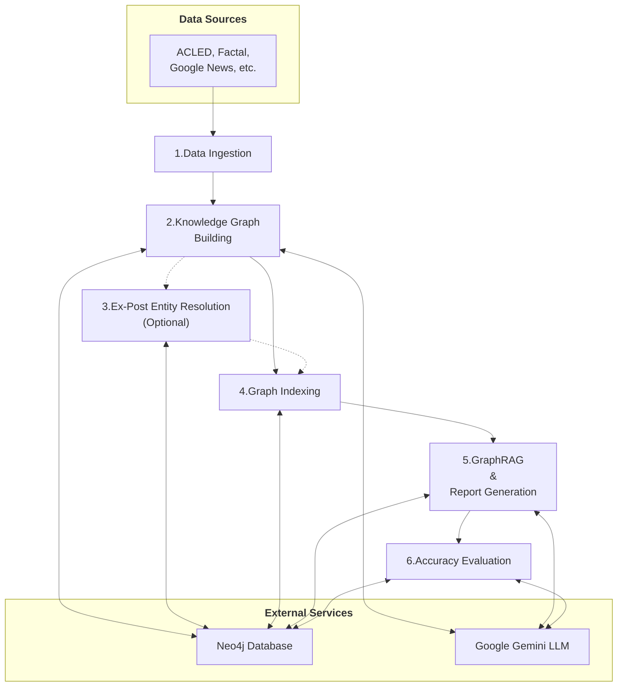

# UN Forward-Looking, Security-focused Country Report Generation Pipeline

This repository contains an end-to-end pipeline for building and querying a knowledge graph from conflict and security event data. It uses the `neo4j-graphrag` library to perform a Retrieval-Augmented Generation (RAG) approach on the graph (`GraphRAG`) to generate forward-looking security reports for specified countries.

## How It Works: Pipeline Overview

The pipeline automates the process from raw data ingestion to final report generation. Each step is configurable and can be run independently.



1.  **Data Ingestion**: Fetches data from sources like the Armed Conflict Location & Event Data Project (ACLED) and saves it locally.
2.  **Knowledge Graph Building**: Processes the data, uses a Large Language Model (LLM) to extract entities (e.g., `Person`, `Organization`) and relationships according to a defined schema, and loads them into a Neo4j graph.
3.  **Ex-Post Entity Resolution**: Merges similar entities in the graph to improve data quality and consistency (e.g., combining "U.N." and "United Nations").
4.  **Graph Indexing**: Creates vector and full-text indexes on the graph data to enable efficient searching and retrieval during the RAG step.
5.  **GraphRAG & Report Generation**: For a given query (e.g., "Generate a security report for Sudan"), it retrieves the most relevant information from the knowledge graph and uses an LLM to synthesize it into a detailed, evidence-based markdown report.
6.  **Accuracy Evaluation**: Assesses the factual accuracy of the generated report by extracting claims and verifying them against the knowledge graph. Optionally, it also rewrites the original report taking into account the factual assessment of the accuracy report, in order to produce a more refined and factually accurate report.

## Getting Started

### 1. Prerequisites

-   Python 3.12 (recommended)
-   Install dependencies: `pip install -r requirements.txt` or through the `uv.lock` if using `uv` as package manager.
-   A Google Gemini API key. You can get a free one [here](https://aistudio.google.com/app/apikey).
-   A Neo4j database. A free cloud-hosted instance from [Neo4j Aura](https://neo4j.com/product/auradb/) is recommended. A self-hosted instance is also possible but may require minor code adjustments.
-   Google Chrome installed to generate the `.svg` plots (through `plotly` and `kaleido`) included in the report.
-   If data ingestion is performed with the sources included by default (Google News, ACLED and Factal), an API key for both ACLED (which can be obtained for free [here](https://acleddata.com/register/)) and [Factal](https://www.factal.com/) (paid tier) are needed.

### 2. Installation & Configuration

1.  Clone the repository and navigate into the `graphrag_pipeline` directory:
    ```bash
    git clone <repository_url>
    cd UN_Conflict_Report/graphrag_pipeline
    ```
2.  Install the required Python packages (or run [`uv sync`](https://docs.astral.sh/uv/getting-started/features/#python-versions)):
    ```bash
    pip install -r requirements.txt
    ```
3.  In the `config_files/` directory, create a `.env` file and add your credentials:
    ```env
    NEO4J_URI=your_neo4j_uri
    NEO4J_USERNAME=neo4j
    NEO4J_PASSWORD=your_password
    GEMINI_API_KEY=your_gemini_api_key
    # Optional API keys for Factal and ACLED only needed if data ingestion is implemented
    ACLED_API_KEY=your_acled_api_key
    ACLED_EMAIL=your_acled_email
    FACTAL_API_KEY=your_factal_api_key
    ```
4.  (Optional) Review the `.json` files in `config_files/` to customize pipeline behavior. For a detailed guide, see `docs/config_files_guide.md`.

### 3. Running the Pipeline

The pipeline is controlled from `main.py` inside the `graphrag_pipeline` directory. You can run steps individually or chain them together.

```bash
# To get help on the available arguments
python main.py --help

# To run the full pipeline: ingest data, build KG, resolve entities ex-post, generate a report for Sudan and create an accuracy evaluation report and a refined report
python main.py --ingest-data "Sudan" --build-kg "Sudan" --resolve-ex-post --retrieval "Sudan" --accuracy-eval

# To only ingest data for a country or a list of countries
python main.py --ingest-data "Sudan" "India" "United States"

# To only build the knowledge graph (assumes data is already ingested) for a country or a list of countries
python main.py --build-kg "Sudan" "India" "United States"

# To generate a report for multiple countries (assumes KG is built and indexed - indexing is automatically done when building the KG)
python main.py --retrieval "Sudan" "UAE"

# To generate a report and save it in a specific output directory
python main.py --retrieval "Sudan" --output-dir "/home/pablo/Downloads"

# To generate a report and then evaluate its accuracy and create a factually corrected report
python main.py --retrieval "Sudan" --accuracy-eval

# To evaluate a specific, existing report
python main.py --accuracy-eval "reports/Sudan/security_report_Sudan_HybridCypher_20250630_120000.md"
```

> **Try out the pipeline without ACLED and Factal API keys**: the repository already includes some sample parquet files with text data for a 3-month period for Factal and ACLED, and for 1 week for Google News (obtained in July 2025), for India, Sudan and the United States. To test the pipeline, you can directly use this data to build a knowledge graph, without having to ingest data previously.

## Pipeline Outputs

There are 3 main products that are produced:

1. The first, most resource-efficient product is the **initial country security report**. This report is obtained through GraphRAG and Google Gemini API, i.e., by retrieving contextual information both from text contained in our knowledge graph but also from graph properties (like nodes and edges) and then passing the context to the LLM. The report is generated in markdown format (so it’s totally editable ex-post), and it has 4 sections: a general overview of the country security situation, a section with the key security events in a country, a forward-looking section with ConflictForecast and ACLED’s predictions at subnational level as well as a description of the most relevant subnational events (if available) and, finally, a section with the sources of the report (as extracted from the knowledge graph).
2. The second product is an **accuracy evaluation report** for each and every claim made in the initial report. Each claim is classified either as true, false or mixed, and includes a justification and the sources for the answer (if available). Context retrieval in this case is semantically much more precise (each claim and question is used to retrieve data from the knowledge graph), thus producing more accurate justifications and referencing. Show claim 8 of the first section of the accuracy report.
3. Our last and most refined product (but also most resource-intensive, both in terms of time and LLM requests) is a **corrected version of the initial security report**, where the claims that were detected as false and mixed are modified as well as the sources are adjusted. 

## Common Issues & Troubleshooting

-   **No Internet Connection**: The pipeline requires internet to contact the Gemini API and Neo4j Aura.
-   **Neo4j Instance Inactive**: Free Neo4j Aura instances pause after 3 days of inactivity and are deleted after 30 days of being paused. Ensure your instance is running before executing the pipeline.
-   **CUDA errors with `torch`** when building the knowledge graph and embedding input texts. Consider using a CPU for better stability (performance should not be downgraded significantly since embedders are just used out-of-the-box).
-   **Gemini API Rate Limits**: The free tier has rate limits (e.g., tokens per minute). Long-running processes can cause errors. See the [rate limits here](https://ai.google.dev/gemini-api/docs/rate-limits#free-tier). Usage of the API can be tracked and checked in [Google AI Studio](https://aistudio.google.com/usage).
-   **Neo4j Tier Limitations**: The free Aura tier is limited to ~200k nodes and ~400k relationships. Ingesting very large datasets may exceed these limits.

## For Developers

For a deeper dive into the architecture, code structure, and contribution guidelines, please see the detailed **[Developer Guide](graphrag_pipeline/docs/dev_guide.md)**.