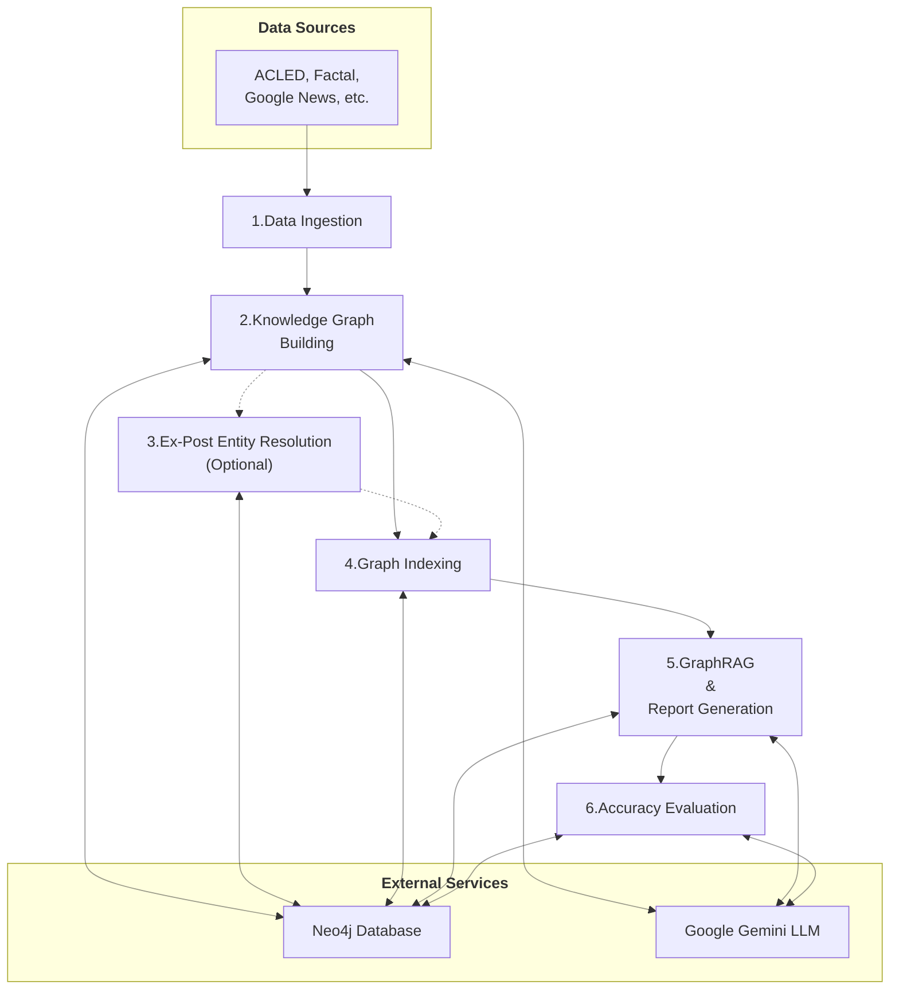

# UN Forward-Looking, Security-focused Country Report Generation Pipeline

This repository contains an end-to-end pipeline for building and querying a knowledge graph from conflict and security event data. It uses the `neo4j-graphrag` library to perform a Retrieval-Augmented Generation (RAG) approach on the graph (`GraphRAG`) to generate forward-looking security reports for specified countries.

## How It Works: Pipeline Overview

The pipeline automates the process from raw data ingestion to final report generation. Each step is configurable and can be run independently.



1.  **Data Ingestion**: Fetches data from sources like the Armed Conflict Location & Event Data Project (ACLED) and saves it locally.
2.  **Knowledge Graph Building**: Processes the data, uses a Large Language Model (LLM) to extract entities (e.g., `Person`, `Organization`) and relationships according to a defined schema, and loads them into a Neo4j graph.
3.  **Ex-Post Entity Resolution**: Merges similar entities in the graph to improve data quality and consistency (e.g., combining "U.N." and "United Nations").
4.  **Graph Indexing**: Creates vector and full-text indexes on the graph data to enable efficient searching and retrieval during the RAG step.
5.  **GraphRAG & Report Generation**: For a given query (e.g., "Generate a security report for Sudan"), it retrieves the most relevant information from the knowledge graph and uses an LLM to synthesize it into a detailed, evidence-based markdown report.
6.  **Accuracy Evaluation**: Assesses the factual accuracy of the generated report by extracting claims and verifying them against the knowledge graph.

## Getting Started

### 1. Prerequisites

-   Python 3.10+
-   A Google Gemini API key. Get a free one [here](https://aistudio.google.com/app/apikey).
-   A Neo4j database. A free cloud-hosted instance from [Neo4j Aura](https://neo4j.com/product/auradb/) is recommended.

### 2. Installation & Configuration

1.  Clone the repository and navigate into the `graphrag_pipeline` directory:
    ```bash
    git clone <repository_url>
    cd UN_Conflict_Report/graphrag_pipeline
    ```
2.  Install the required Python packages:
    ```bash
    pip install -r requirements.txt
    ```
3.  In the `config_files/` directory, create a `.env` file and add your credentials:
    ```env
    # filepath: graphrag_pipeline/config_files/.env
    NEO4J_URI="your-neo4j-aura-uri"
    NEO4J_USERNAME="neo4j"
    NEO4J_PASSWORD="your_password"
    GEMINI_API_KEY="your_gemini_api_key"
    ```
4.  (Optional) Review the `.json` files in `config_files/` to customize pipeline behavior. For a detailed guide, see `docs/config_files_guide.md`.

### 3. Running the Pipeline

The pipeline is controlled from `main.py` inside the `graphrag_pipeline` directory. You can run steps individually or chain them together.

```bash
# Get help on all available commands
python main.py --help

# Example: Run the full pipeline for Sudan
python main.py --ingest --build-kg --resolve-ex-post --retrieval "Sudan"

# Example: Generate a report for a country (assumes KG is already built)
python main.py --retrieval "Sudan"

# Example: Generate a report and evaluate its accuracy
python main.py --retrieval "Sudan" --accuracy-eval
```

## Pipeline Outputs

-   **Security Reports**: Detailed markdown reports are saved in the `reports/` directory, organized by country.
-   **Accuracy Evaluations**: A JSON file containing a claim-by-claim factual analysis is generated alongside the report it evaluates.

## Common Issues & Troubleshooting

-   **No Internet Connection**: The pipeline requires internet to contact the Gemini API and Neo4j Aura.
-   **Neo4j Instance Inactive**: Free Neo4j Aura instances pause after 3 days of inactivity and are deleted after 30 days of being paused. Ensure your instance is running before executing the pipeline.
-   **Gemini API Rate Limits**: The free tier has rate limits (e.g., tokens per minute). Long-running processes can cause errors. See the [rate limits here](https://ai.google.dev/gemini-api/docs/rate-limits#free-tier).
-   **Neo4j Tier Limitations**: The free Aura tier is limited to ~200k nodes and ~400k relationships. Ingesting very large datasets may exceed these limits.

## For Developers

For a deeper dive into the architecture, code structure, and contribution guidelines, please see the detailed **[Developer Guide](graphrag_pipeline/docs/dev_guide.md)**.