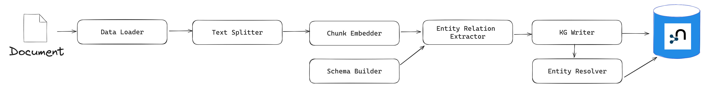

# Knowledge Graph Pipeline Overview

## Pipeline Steps

### 1. Data Ingestion
- **Sources**: GDELT, ACLED, Factal, Google News
- **ACLED CAST Analysis**: Conflict forecasting and risk mapping
- **Output**: Standardized data files in `data/` folder
- **Configuration**: `config_files/data_sources_config.json`

#### ACLED CAST Analysis (`acled_cast_analysis.py`)

The ACLED CAST (Conflict Alert and Surveillance Tool) analysis script provides comprehensive conflict risk assessment and visualization capabilities:

**Features:**
- Retrieves ACLED CAST forecast data via API
- Calculates rolling averages for 1, 3, 6, and 12 months
- Computes percent increase in conflict risk compared to historical averages
- Identifies hotspots and regions with significant changes (>25% increase)
- Downloads admin1 boundary shapefiles automatically
- Creates interactive choropleth maps with Plotly
- Saves results in multiple formats (HTML, PDF, SVG, Parquet)

**Configuration:**
Add an `acled_cast` section to `config_files/data_ingestion_config.json`:
```json
"acled_cast": {
  "country": "Afghanistan",
  "window": 1,
  "horizon": 2,
  "forecast_horizon": 2,
  "window_size": 1
}
```

**Usage:**
```bash
cd pipeline/01_data_ingestion
python acled_cast_analysis.py
```

**Outputs:**
- Interactive maps: `data/images/cast_conflict_map_[country]_[timestamp].[html|pdf|svg]`
- Processed data: `data/acled_cast/cast_analysis_[country]_[timestamp].parquet`

**Requirements:**
- ACLED API credentials in environment variables: `ACLED_EMAIL`, `ACLED_API_KEY`
- Additional packages: `geopandas`, `plotly`, `pycountry`, `shapely`, `kaleido`

### 2. Knowledge Graph Building
- **Input**: Processed data files
- **Process**: Entity extraction, relationship identification, temporal KG construction
- **Output**: Neo4j knowledge graph

### 3. Knowledge Graph Indexing
- **Input**: Neo4j knowledge graph
- **Process**: Embedding generation, full-text indexing
- **Output**: Indexed KG ready for retrieval

### 4. GraphRAG Query
- **Input**: User queries
- **Process**: Retrieval + LLM generation
- **Output**: Contextual answers based on KG

# About the library

This library creates the end-to-end pipeline for GraphRAG, from the creation of the knowledge graph to the retrieval with RAG + graph capabilities.

General references:
1. [Neo4j GraphRAG Python library user guide](https://neo4j.com/docs/neo4j-graphrag-python/current/index.html).
2. [Neo4j GraphRAG Python library API documentation](https://neo4j.com/docs/neo4j-graphrag-python/current/api.html).
3. The implementation of this module is also inspired on (and, in many cases, builds upon) the [examples from the `neo4j-graphrag-python` library](https://github.com/neo4j/neo4j-graphrag-python/tree/main/examples).

# Building the knowledge graph: `kg_builder` module

## Why we cannot use `SimpleKGPipeline` out of the box (for now)

For 2 main reasons:
1. Using this pre-defined pipeline, it is not possible to reliably create document chunks from available metadata (like can be done when creating the graph from PDF files). Text data will most likely be inputted from some sort of data frame, where in one column the text will be stored and other columns will contain metadata (e.g., the title of the news article, the news outlet, the author, a unique document identifier, etc.). To create a node with the label "Document" which is linked to a text chunk and which includes relevant document metadata (title, source, author, etc.), we need to build a pipeline with a custom `LexicalGraphBuilder` instance.
2. To extend entity resolution and make it less conservative. Behind the scenes, `SimpleKGPipeline` uses the `SinglePropertyExactMatchResolver`, which "merge[s] nodes with same label and exact same property value (by default using the "name" property)." The resolver cannot be changed with any parameter of the `SimpleKGPipeline`, but the custom resolution should be done ex-post (after instantiating the graph, which can be inconvenient due to storage constraints). A resolver which can be much more useful is the `SpaCySemanticMatchResolver`, which "merges nodes with same label and similar textual properties (by default using the "name" property) based on spaCy embeddings and cosine similarities of embedding vectors." This can be much more useful as it can merge documents which are extremely similar in meaning.

## How to create a custom pipeline for building a KG

Main steps behind the KG construction pipeline (source: [User Guide: Knowledge Graph Builder](https://neo4j.com/docs/neo4j-graphrag-python/current/user_guide_kg_builder.html)), which is implemented in the `CustomKGPipeline` clsas:

> A Knowledge Graph (KG) construction pipeline requires a few components (some of the below components are optional):
> 
> - **Data loader**: extract text from files (PDFs, …).
> - **Text splitter**: split the text into smaller pieces of text (chunks), manageable by the LLM context window (token limit).
> - **Chunk embedder** (optional): compute the chunk embeddings.
> - **Schema builder**: provide a schema to ground the LLM extracted entities and relations and obtain an easily navigable KG.
> - **Lexical graph builder**: build the lexical graph (Document, Chunk and their relationships) (optional).
> - **Entity and relation extractor**: extract relevant entities and relations from the text.
> - **Knowledge Graph writer**: save the identified entities and relations.
> - **Entity resolver**: merge similar entities into a single node. Can be integrated in the pipeline or applied ex-post, once the knowledge graph has already been created.



User guides (essential to understand how to create the pipeline and maintain it):
1. [User Guide: Knowledge Graph Builder](https://neo4j.com/docs/neo4j-graphrag-python/current/user_guide_kg_builder.html)
2. [User Guide: Pipeline](https://neo4j.com/docs/neo4j-graphrag-python/current/user_guide_pipeline.html)

## Implementation guide

### Parameters

There are 3 "levels" of configuration for the implementation of the library (creation of the knowledge graph):

1. Library scripts (e.g., `custom_kg_pipeline.py` or `build_kg_from_df.py`). These classes or functions are designed such that they should not require regular tweaking, but serve as the basic structure for creating the knowledge graph.
2. Implementation scripts. Certain parameters of the class that builds the knowledge graph, `CustomKGPipeline`, are not meant to be tweaked constantly (e.g., the resolver, the batch size for instantiating the Neo4j graph with data, etc.). Ideally, there are some "optimal" values for these parameters which should be relatively easy to find and to keep constant.
3. Configuration files (`.json`) and environment files (`.env`). The former files contain parameters that can and should be tweaked relatively more often in order to find the best performance. These include:
    - Configuration of the text splitter (chunk size, chunk overlap, etc.). This should be adapted taking into consideration, mainly, the embedding model and LLM's context window, the rate limits for the LLM, etc. 
    - Embedding model for text embedding of the input. Must be one of the `SentenceTransformer` models (see the available models [here](https://sbert.net/docs/sentence_transformer/pretrained_models.html#original-models)).
    - LLM for named entity recognition and its configuration (e.g., temperature).
    - Schema configuration, like whether to use a template for creating the nodes and edges, the suggested triplets, etc.
    - Prompt template that is passed to the LLM for the creation of the knowledge graph.
    - Examples to pass to the LLM for few-shot learning to improve the creation of the knowledge graph.
  
    On the other hand, the variables in the `.env` file should be adjusted accordingly to the Neo4j database where the KG will be stored and the Gemini API key.

### About the configuration file: allowed and forbidden changes

> All of the values from the JSON configuration file (e.g., `"gemini-2.0-flash"` in ` "model_name": "gemini-2.0-flash"`) can be adjusted. Nevertheless, **the keys should not be modified under any circumstance** (as the pipeline sometimes expects the existence of some keys with particular names). 

Furthermore, in the schema configuration, `nodes`, `edges` and `triplets` need to have the following structure (but with the option of omitting some fields):

```{json}
{
    ...
    "schema_config": {
        ...
        "nodes": [
            {"label": "Event", 
            "description": "Significant occurrences of the input text, such as conflicts, elections, coups, attacks or any other relevant information",
            "properties": [
                {"name": "name", "type": "STRING", "description": "Clarifying description for the property."},
                {"name": "date", "type": "DATE"},
                {"name": "end_date", "type": "DATE"},
                {"name": "type", "type": "STRING"},
                {"name": "severity", "type": "INTEGER"},
                {"name": "description", "type": "STRING"}
            ]},
            
            ...
            
        ],
        "edges": [
            {"label": "OCCURRED_IN", 
            "description": "Indicates where an event took place",
            "properties": [
                {"name": "start_date", "type": "DATE"},
                {"name": "end_date", "type": "DATE", "description": "This description makes the LLM understand dates much better."},
                {"name": "certainty", "type": "FLOAT"}
            ]},
            
            ...

        ],
        ...
        "triplets": [
            [
                "Event",
                "OCCURRED_IN",
                "Country"
            ],
            [
                "Event",
                "OCCURRED_IN",
                "Region"
            ],
            ...
        ],
        ...
    },
    ...
}
```

Possible property types for the schema (`SchemaProperty`):

```
"BOOLEAN",
"DATE",
"DURATION",
"FLOAT",
"INTEGER",
"LIST",
"LOCAL_DATETIME",
"LOCAL_TIME",
"POINT",
"STRING",
"ZONED_DATETIME",
"ZONED_TIME"
```

### Embedding models

Generally, embedding models (pure encoder models) have a much lower context window than LLMs (like ChatGPT or Gemini), of (generally) less than 1,000 tokens of context window in the first case and approximately 1M tokens context window in the latter. This creates a (small, in our use case) conflict between the embedding model and the LLM for entity recognition:
- For an embedding model to encode the whole text chunk coming from a news article, text chunks have to be relatively small, which would generate the need of splitting articles into more than one piece. 
- On the other hand, if articles are split into more than one text chunk, the LLM used for entity recognition will have to be called more often, which can increase the pricing. This can be especially inconvenient if we use the free tier of Gemini models, which have a limit on the requests per minute and requests per day that can be done. This would not be an issue if the limitations were purely based on the input and output tokens.

Consider the example of the following [article](https://natlawreview.com/article/state-law-business-interruption-insurance-coverage-covid-19-claims): in total the body of the article contains approximately 2,500 tokens (according to this [tool](https://tokenizer.streamlit.app/)). On the other hand, the `SentenceTransformer` model that generally offers the best ratio performance-efficiency (`all-MiniLM-L6-v2`) has a maximum sequence length (or context window) of 256 tokens (see the information [here](https://sbert.net/docs/sentence_transformer/pretrained_models.html#original-models)). This would make the model encode only this first part of the sample article:

> It’s been a year since COVID-19 caused a torrent of insurance coverage litigation regarding business interruption and extra expense coverage for losses due to governmental orders, shut down requirements, and the spread of the coronavirus. With more than 335 decisions having been issued as of early May 2021, the numbers show significantly better odds for policyholders than the insurance industry and many media reports suggest.
> 
> ‘So you’re saying that there’s a chance!’
> 
> There are more than 50 decisions in which courts have either granted summary judgment to policyholders or denied insurance companies’ motions to dismiss in the context of business interruption and extra expense insurance claims resulting from the pandemic. 
> 
> The earliest decisions largely favored insurance carriers, with courts granting motions to dismiss in those cases. But many of those early cases involved policies with express virus exclusions. More recent decisions have rejected insurance carrier arguments and either denied their motions for dismissal or judgement on the pleadings, or ruled in the policyholder’s favor on dispositive motions.
Key points from favorable rulings
> 
> The central argument in the majority of these cases is whether there is physical loss or damage to the policyholder’s locations (for business interruption coverage), or whether communicable disease coverage was triggered (for those policies with such coverage). Certain insurance policies with communicable

In the case of news articles, this sequence length can be more than enough to capture the general meaning of the text (as the most relevant information is generally on top). However, the following models can also be useful in order to increase the maximum sequence length and capture more of the semantics of a text (see all of the available `SentenceTransformer` models [here](https://sbert.net/docs/sentence_transformer/pretrained_models.html#original-models)):
- `all-mpnet-base-v2`. According to the authors of the library, this model "provides the best quality". It has a maximum sequence length of 384 tokens.
- `all-distilroberta-v1`. 1.5 times faster than `all-mpnet-base-v2`, and with a larger maximum sequence length (512 tokens).
- `all-MiniLM-L6-v2`. "5 times faster [than `all-mpnet-base-v2`] and still offers good quality". Maximum sequence length of 256 tokens.

Another alternative is to use a free (but not open-source) embedding model, like Google's [`text-embedding-004`](https://ai.google.dev/gemini-api/docs/models#text-embedding), which can take up to 2,048 input tokens and is [free of charge](https://ai.google.dev/gemini-api/docs/pricing) (but with a rate limit of 1,500 requests per minute). 

# Indexing the knowledge graph: `kg_indexer` module

Indexing particular elements of the graph enables faster queries over those elements. In the use case of GraphRAG, indexing the text embeddings or the text itself speeds up the process of information retrieval.
- Vector (embedding) indexes are needed for those retrievers which exploit the numerical representation of the ingested data (text) in order to find the most relevant information that answers a query.
- Text indexes, on the other hand, are useful for those retrievers which explore the actual text of the ingested data in order to answer a query with the information contained in a knowledge graph.

References:
1. [User guide of `graphrag-neo4j` on database operations](https://neo4j.com/docs/neo4j-graphrag-python/current/user_guide_rag.html#db-operations).
2. [API documentation of `graphrag-neo4j` on database interaction](https://neo4j.com/docs/neo4j-graphrag-python/current/api.html#database-interaction).

# Retrieving information from the knowledge graph: using retrievers

It is at this stage that the advantages of GraphRAG can be exploited, by making use of the generated text embeddings as well as the possibility of traversing the graph and finding relevant information related to a document.

| Retriever                 | Description                                                                                                                                                                                                                                                   |
| ------------------------- | ------------------------------------------------------------------------------------------------------------------------------------------------------------------------------------------------------------------------------------------------------------- |
| **VectorRetriever**       | Performs a similarity search based on a Neo4j vector index and a query text or vector. Returns the matched node and similarity score.                                                                                                                         |
| **VectorCypherRetriever** | Performs a similarity search based on a Neo4j vector index and a query text or vector. The returned results can be configured through a retrieval query parameter executed after the index search. Can be used to fetch more context around the matched node. |
| **HybridRetriever**       | Uses both a vector and a full-text index in Neo4j.                                                                                                                                                                                                            |
| **HybridCypherRetriever** | Same as HybridRetriever with a retrieval query similar to VectorCypherRetriever.                                                                                                                                                                              |
| **Text2Cypher**           | Translates the user question into a Cypher query to be run against a Neo4j database (or Knowledge Graph). The results are then passed to the LLM to generate the final answer. Note that, in this case, no similarity-based or full-text based method is used to retrieve information.                                                                                 |


References:
1. Essential user guide for understanding how to structure of the retriever: [User Guide: RAG](https://neo4j.com/docs/neo4j-graphrag-python/current/user_guide_rag.html#). Main useful information is from the ["Retriever Configuration"](https://neo4j.com/docs/neo4j-graphrag-python/current/user_guide_rag.html#retriever-configuration) section onwards. 
2. [API documentation on the available retrievers](https://neo4j.com/docs/neo4j-graphrag-python/current/api.html#retrievers).
3. [API documentation on GraphRAG](https://neo4j.com/docs/neo4j-graphrag-python/current/api.html#graphrag) (used to generate the final output).