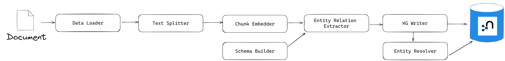

# Why we cannot use `SimpleKGPipeline` out of the box (for now)

For 2 main reasons:
1. Using this pre-defined pipeline, it is not possible to reliably create document chunks from available metadata (like can be done when creating the graph from PDF files). Text data will most likely be inputted from some sort of data frame, where in one column the text will be stored and other columns will contain metadata (e.g., the title of the news article, the news outlet, the author, a unique document identifier, etc.). To create a node with the label "Document" which is linked to a text chunk and which includes relevant document metadata (title, source, author, etc.), we need to build a pipeline with a custom `LexicalGraphBuilder` instance.
2. To extend entity resolution and make it less conservative. Behind the scenes, `SimpleKGPipeline` uses the `SinglePropertyExactMatchResolver`, which "merge[s] nodes with same label and exact same property value (by default using the "name" property)." The resolver cannot be changed with any parameter of the `SimpleKGPipeline`, but the custom resolution should be done ex-post (after instantiating the graph, which can be inconvenient due to storage constraints). A resolver which can be much more useful is the `SpaCySemanticMatchResolver`, which "merges nodes with same label and similar textual properties (by default using the "name" property) based on spaCy embeddings and cosine similarities of embedding vectors." This can be much more useful as it can merge documents which are extremely similar in meaning.

# How to create a custom pipeline for building a KG

Main steps behind the KG construction pipeline (source: [User Guide: Knowledge Graph Builder](https://neo4j.com/docs/neo4j-graphrag-python/current/user_guide_kg_builder.html)):

> A Knowledge Graph (KG) construction pipeline requires a few components (some of the below components are optional):
> 
> - **Data loader**: extract text from files (PDFs, …).
> - **Text splitter**: split the text into smaller pieces of text (chunks), manageable by the LLM context window (token limit).
> - **Chunk embedder** (optional): compute the chunk embeddings.
> - **Schema builder**: provide a schema to ground the LLM extracted entities and relations and obtain an easily navigable KG.
> - **Lexical graph builder**: build the lexical graph (Document, Chunk and their relationships) (optional).
> - **Entity and relation extractor**: extract relevant entities and relations from the text.
> - **Knowledge Graph writer**: save the identified entities and relations.
> - **Entity resolver**: merge similar entities into a single node.
>
> 


User guides (essential to understand how to create the pipeline and maintain it):
1. [User Guide: Knowledge Graph Builder](https://neo4j.com/docs/neo4j-graphrag-python/current/user_guide_kg_builder.html)
2. [User Guide: Pipeline](https://neo4j.com/docs/neo4j-graphrag-python/current/user_guide_pipeline.html)

# Implementation guide

## About the configuration file: allowed and forbidden changes

All of the values from the JSON configuration file (e.g., `"gemini-2.0-flash"` in ` "model_name": "gemini-2.0-flash"`) can be adjusted. Nevertheless, **the keys should not be modified under any circumstance** (as the pipeline sometimes expects the existence of some keys with particular names). 

Furthermore, in the schema configuration, `nodes`, `edges` and `triplets` need to have the following structure (but with the option of omitting some fields):

```{json}
{
    ...
    "schema_config": {
        ...
        "nodes": [
            {"label": "Event", 
            "description": "Significant occurrences of the input text, such as conflicts, elections, coups, attacks or any other relevant information",
            "properties": [
                {"name": "name", "type": "STRING", "description": "Clarifying description for the property."},
                {"name": "date", "type": "DATE"},
                {"name": "end_date", "type": "DATE"},
                {"name": "type", "type": "STRING"},
                {"name": "severity", "type": "INTEGER"},
                {"name": "description", "type": "STRING"}
            ]},
            
            ...
            
        ],
        "edges": [
            {"label": "OCCURRED_IN", 
            "description": "Indicates where an event took place",
            "properties": [
                {"name": "start_date", "type": "DATE"},
                {"name": "end_date", "type": "DATE", "description": "This description makes the LLM understand dates much better."},
                {"name": "certainty", "type": "FLOAT"}
            ]},
            
            ...

        ],
        ...
        "triplets": [
            [
                "Event",
                "OCCURRED_IN",
                "Country"
            ],
            [
                "Event",
                "OCCURRED_IN",
                "Region"
            ],
            ...
        ],
        ...
    },
    ...
}
```

Possible property types for the schema (`SchemaProperty`):

```
"BOOLEAN",
"DATE",
"DURATION",
"FLOAT",
"INTEGER",
"LIST",
"LOCAL_DATETIME",
"LOCAL_TIME",
"POINT",
"STRING",
"ZONED_DATETIME",
"ZONED_TIME"
```