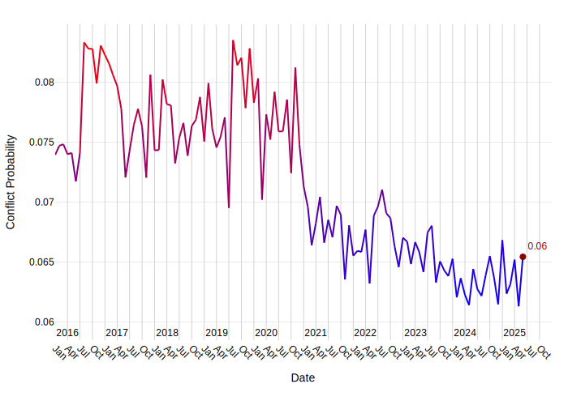
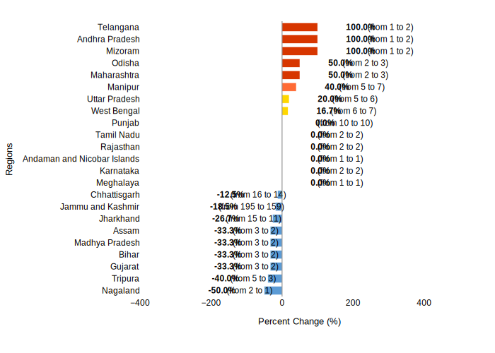

# India Security Report: Recent Developments and Forward Outlook

## 1. Overview
India's security landscape in early to mid-2025 is characterized by a mix of persistent internal conflicts, cross-border tensions, and emerging threats. The nation continues to grapple with militant activities, particularly in Jammu and Kashmir and Manipur, alongside instances of civil unrest and the ongoing threat of terrorism. Regionally, India is recognized as a major power with a crucial role in ensuring peace and stability in the Indo-Pacific [8].

### Internal Security Challenges
Internal security remains a significant concern, with ongoing violence between communities in states like Manipur and localized incidents of mob violence and protests across various regions. The presence of militant groups and the threat of terrorism necessitate continuous vigilance and proactive security measures.

### Cross-Border Dynamics
Tensions along the India-Pakistan border persist, marked by artillery exchanges and attempts at infiltration. India's military forces are actively engaged in defensive and retaliatory operations to counter these threats.

## 2. Key Security Events

### Cross-Border Engagements with Pakistan
On 8 May 2025, Pakistani military forces engaged in artillery firing along the Line of Control (LoC) in Jammu and Kashmir, which was met with a response from Indian forces in areas including Muthal, Torna, Rustom, and Urusa in Srinagar. No casualties were reported in this incident [7]. The same day, India's air defense systems, including surface-to-air missile systems and an Integrated Counter UAS Grid, intercepted Pakistani drones and missiles in the Jalandhar district of Punjab. These were reportedly sent after Indian military forces destroyed nine suspected terror sites in Pakistan on 7 May 2025, in retaliation to the Pahalgam attack [11]. On 10 May 2025, a missile fragment, believed to be from Pakistani strikes, was observed in Jaisalmer, Rajasthan [16]. Furthermore, on 11 May 2025, the Pakistani military media spokesperson claimed retaliatory attacks targeting Indian military installations in Rajasthan, Haryana, Punjab, and Jammu and Kashmir, asserting that no civilians were targeted [18]. Indian military forces also claimed to have thwarted multiple attempts from the Pakistani side to penetrate the Line of Control in Jammu and Kashmir during several days of clashes around 11 May 2025 [9].

### Counter-Militancy Operations in Jammu and Kashmir
Indian security forces have been actively engaged in counter-militancy operations in Jammu and Kashmir. On 13 May 2025, local media reported an ongoing firefight between Indian security forces and Kashmiri militants near Shukroo Keller in the Shopian area [5]. Earlier, on 12 April 2025, at least two militants were killed in an encounter with Indian security forces in Kishtwar district [10]. Operations continued, with three militants reported killed in Awantipora on 15 May 2025 [15], and two more militants killed during an encounter in the Chatroo area of Kishtwar on 22 May 2025 [12].

### Internal Conflict in Manipur
Manipur continues to experience violence between Meitei and Tribal communities. On 9 April 2025, Manipur police retrieved a 9 mm Pistol with ammunition from Mayang Imphal Maibam Konjil Mayai Leikai in Mayang Imphal village, belonging to unidentified armed assailants [2]. More recently, on 13 June 2025, a joint team of central and state security forces dismantled a temporary camp set up by suspected cadres of an underground militant group during a search operation in the Baruni Hills of Imphal East district. Several items, including radio sets and wireless equipment, were recovered [1].

### Counter-Terrorism Efforts
On 19 May 2025, police in Telangana arrested two suspected Islamic State sympathizers who were reportedly planning an attack on the city of Hyderabad [6]. This highlights the persistent threat of domestic terrorism.

### Civil Unrest and Protests
Instances of civil unrest have been observed across the country. On 15 May 2025, members of the Andhra Pradesh United Teachers' Federation (APUTF) and United Teachers Federation staged a peaceful protest in Vijayawada city, Andhra Pradesh, against a proposed restructuring of the school system [4]. In Bihar, at least 12 people were injured in clashes over a land dispute in Nawada on 8 April 2025 [17]. More severe mob violence occurred in Uttar Pradesh on 5 June 2025, where two groups clashed and pelted stones at each other over a land dispute in Rajapur Kamauli village, resulting in one fatality and nine injuries [13]. In Assam, on 2 May 2025, two independent candidates and their supporters clashed with sharp-edged weapons at a polling station in Patharkandi town on the first day of the Panchayat elections, injuring at least seven people [14].

### Infrastructure Security Enhancements
On 9 May 2025, heightened security measures were introduced at Chhatrapati Shivaji Maharaj International Airport in Mumbai, Maharashtra, although the airport remained operational [3].

## 3. Forward Outlook

### Armed Conflict Probability Forecast (ConflictForecast)

According to [ConflictForecast](https://conflictforecast.org/), there is a 6.54% estimated probability that India will experience an outbreak of armed conflict within the next three months.

*This forecast reflects the likelihood that the country will exceed a threshold of 0.5 fatalities per one million inhabitants over the course of three months.*

The trend in armed conflict risk, 2016-2025.

### Subnational Perspective

#### Predicted Increase in Violent Events in the Next Month (ACLED)

[ACLED CAST](https://acleddata.com/conflict-alert-system/) predicts 6 ADM1 regions in India to be hotspots for violent events in the next calendar month (August, 2025).

*An ADM1 region is considered to be a hotspot if the predicted increase in the number of violent events in the next month compared to the 3-month average is at least of 25%.*

The chart below shows regions with a predicted change in violent events.

Considering the hotspot criteria, the following regions are expected to have a significant increase in violent events in August, 2025:

| Region | Avg. # Violent Events (3 months) | Forecasted # Violent Events | % Increase |
|---|---|---|---|
| Mizoram | 1 | 2 | 100.0% |
| Telangana | 1 | 2 | 100.0% |
| Maharashtra | 2 | 3 | 50.0% |
| Odisha | 2 | 3 | 50.0% |
| Andhra Pradesh | 1 | 2 | 100.0% |
| Manipur | 5 | 7 | 40.0% |
#### Manipur
The ongoing violence between Meitei and Tribal communities in Manipur, as evidenced by the dismantling of militant camps and weapons seizures in June and April 2025 [1, 2], suggests that the state will likely continue to experience significant security challenges. Sustained security force operations will be necessary to address the activities of underground militant groups and maintain order amidst inter-communal tensions.

#### Telangana
The arrest of suspected Islamic State sympathizers in Hyderabad on 19 May 2025 [6] indicates a persistent threat of urban terrorism. Security agencies in Telangana will need to maintain high alert and continue intelligence-led operations to preempt potential attacks and neutralize terror cells.

#### Maharashtra
The implementation of heightened security measures at Chhatrapati Shivaji Maharaj International Airport in Mumbai on 9 May 2025 [3] points to an ongoing assessment of potential threats to critical infrastructure. Vigilance and robust security protocols will remain crucial for major urban centers and transportation hubs in Maharashtra.

#### Andhra Pradesh
The peaceful protest by teachers in Vijayawada on 15 May 2025 [4] highlights the potential for continued civil unrest stemming from policy changes. While peaceful, such demonstrations can escalate, requiring authorities to monitor and manage public grievances effectively to prevent broader disruptions.

### Regional Stability and Geopolitical Role
India's role as a major power in the Indo-Pacific region is deemed essential for international community prosperity, as highlighted by discussions on 1 July 2025, focusing on in-depth strategic discussions on the current international situation and future cooperation to advance a free and open Indo-Pacific [8]. This indicates a forward-looking commitment to regional security and multilateral engagement.

## 4. Sources
[1] null: 2025-06-13
[2] null: 2025-04-09
[3] x.com/ians_india: x.com/ians_india/status/1920751234719547869, 2025-05-09
[4] null: 2025-05-15
[5] x.com/GreaterKashmir: x.com/GreaterKashmir/status/1922162177160421789, 2025-05-13
[6] x.com/ndtv: x.com/ndtv/status/1924271662381625501, 2025-05-19
[7] null: 2025-05-08
[8] U.S. Department of State (.gov): https://www.state.gov/releases/office-of-the-spokesperson/2025/07/secretary-of-state-marco-rubio-indian-external-affairs-minister-subrahmanyam-jaishankar-australian-foreign-minister-penny-wong-and-japanese-foreign-minister-iwaya-takeshi-remarks-to-the-press/, 2025-07-01
[9] x.com/ShivAroor: x.com/ShivAroor/status/1921565407808303379, 2025-05-11
[10] x.com/PTI_News: x.com/PTI_News/status/1910891453535998116, 2025-04-12
[11] null: 2025-05-08
[12] greaterkashmir.com: https://www.greaterkashmir.com/gk-top-news/two-terrorists-killed-in-jks-kishtwar/, 2025-05-22
[13] null: 2025-06-05
[14] null: 2025-05-02
[15] x.com/ChinarcorpsIA: x.com/ChinarcorpsIA/status/1922921351259513177, 2025-05-15
[16] x.com/ians_india: x.com/ians_india/status/1921041670407119157, 2025-05-10
[17] x.com/ZeeBiharNews: x.com/ZeeBiharNews/status/1909495703149359414, 2025-04-08
[18] x.com/DunyaNews: x.com/DunyaNews/status/1921619021109014811, 2025-05-11

---

# Metadata

**Generated on:** 2025-07-08 09:08:18

**Country:** India

**Retriever used for report generation:** HybridCypher

**Forecast data path:** forecast_data_India_2025-07-08-09-07-39.json

**Configuration:**
- search_params: {'top_k': 20, 'ranker': 'linear', 'alpha': 0.5}
- graphrag_model: gemini-2.5-flash