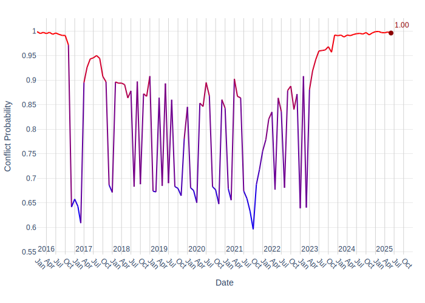

Sudan Security Report: Recent Developments and Forward Outlook

## 1. Overview

The security landscape in Sudan remains highly volatile [1], [2], [3], marked by persistent conflict between the Sudanese Armed Forces (SAF) and the Rapid Support Forces (RSF) [3], alongside other armed groups [4], [5], [6].

## 2. Key Security Events

### 2.1 Intensified Clashes and Drone Warfare
In North Darfur, El Fasher and its surrounding areas have been sites of persistent and severe fighting [7, 8, 9, 3, 10]. Specifically, Zamzam Camp [11] and Abu Shouk camp [12] have also experienced severe clashes.

### 2.2 Political Developments
The Rapid Support Forces (RSF) have engaged in political maneuvering, forming an alliance with the Sudan People’s Liberation Movement-North (SPLM-N) [13] and other groups, including various militias [14]. This alliance aims to govern areas under RSF control, primarily within Darfur [13].

### 2.3 Impact on United Nations Humanitarian Operations
The ongoing conflict has severely impacted humanitarian operations, leading to significant restrictions on aid delivery [15], and has had a severe impact on civilian populations [16, 17]. A notable incident involved an attack on a World Food Programme (WFP) and United Nations Children's Fund (UNICEF) aid convoy near Al Koma, North Darfur [18]. This attack resulted in the deaths of five members [19, 21], injuries to several others [20, 21], and the burning of multiple trucks [20, 21].

## 3. Forward Outlook
### Armed Conflict Probability Forecast (Conflict Forecast)

According to [ConflictForecast](https://conflictforecast.org/), the predicted probability of armed conflict in Sudan in the next 3 months is of 99.61%.

*This prediction represents the risk that a country suffers an outbreak of armed conflict within the next three months, i.e. that the country goes from no fatalities to over 0.5 fatalities per one million inhabitants within a time horizon of three months.*

The following chart displays the armed conflict risk trend since 2020 until the present day:

### Subnational Perspective
Nine subnational ADM1 regions are classified as hotspots [22]. The identified hotspots exhibit an an expected increase of at least 25% in violent events in the short term [22].

#### Predicted Increase in Violent Events in the Short Term (ACLED)

[ACLED CAST](https://acleddata.com/conflict-alert-system/) predicts 9 ADM1 regions in Sudan to be hotspots for violent events in the next calendar month (August, 2025).

*An ADM1 region is considered to be a hotspot if the predicted increase in the number of violent events in the next month compared to the 3-month average is at least of 25%.*

The chart below shows regions with a predicted change in violent events.

Considering the hotspot criteria, the following regions are expected to have a significant increase in violent events in August, 2025:

| Region | Avg. # Violent Events (3 months) | Forecasted # Violent Events | % Increase |
|---|---|---|---|
| Central Darfur | 5 | 7 | 40.0% |
| Blue Nile | 1 | 5 | 400.0% |
| Northern | 7 | 9 | 28.6% |
| Aj Jazirah | 7 | 12 | 71.4% |
| River Nile | 2 | 6 | 200.0% |
| Khartoum | 33 | 49 | 48.5% |
| Sennar | 2 | 4 | 100.0% |
| West Darfur | 2 | 4 | 100.0% |
| Gedaref | 0 | 3 | 30.0% |

#### Central Darfur
-   Average violent events (last 3 months): 5.0 [22]
-   Predicted violent events (short term): 7.0 [22]
-   Percentage increase: 40.0% [22]

#### Blue Nile
-   Average violent events (last 3 months): 1.0 [22]
-   Predicted violent events (short term): 5.0 [22]
-   Percentage increase: 400.0% [22]

#### Northern
-   Average violent events (last 3 months): 7.0 [22]
-   Predicted violent events (short term): 9.0 [22]
-   Percentage increase: 28.57% [22]

#### Aj Jazirah
-   Average violent events (last 3 months): 7.0 [22]
-   Percentage increase: 71.43% [22]

#### River Nile
-   Average violent events (last 3 months): 2.0 [22]
-   Predicted violent events (short term): 6.0 [22]
-   Percentage increase: 200.0% [22]

#### Khartoum
-   Average violent events (last 3 months): 33.0 [22]
-   Predicted violent events (short term): 49.0 [22]
-   Percentage increase: 48.48% [22]

#### Sennar
-   Average violent events (last 3 months): 2.0 [22]
-   Predicted violent events (short term): 4.0 [22]
-   Percentage increase: 100.0% [22]

#### West Darfur
-   Average violent events (last 3 months): 2.0 [22]
-   Predicted violent events (short term): 4.0 [22]
-   Percentage increase: 100.0% [22]

#### Gedaref
-   Average violent events (last 3 months): 0.0 [22]
-   Predicted violent events (short term): 3.0 [22]
-   Percentage increase: 30.0% [22]

## Sources
[1] Owen: https://example.com/sudan-fires
[2] Jessica: https://example.com/sudan-clashes
[3] Al Jazeera: https://www.aljazeera.com/news/2025/4/11/editors-note-one-local-journalist-is-reporting-without-citing-sources-that-the-paramilitary-group-rsf-launched-new-strikes-in-the-sudanese-city-of-el-fasher-prompting-army-to-respond-with-artillery-clashes-between-the-group-and-armed-forces-have-continued-to-escalate-this-week-after-rsf-reportedly-captured-um-kadadah-a-key-town-on-the-road-to-el-fasher-the-sudanese-military-said-earlier-that-at-least-20-people-have-been-killed-during-rsf-paramilitary-shelling-in-the-city-we-are-continuing-to-follow-the-situation-closely-jessica
[4] Internal Report: Clashes in Bau, Blue Nile, 25 June 2025
[5] Internal Report: Clashes in Dilling, South Kordofan, 25 June 2025
[6] Al Jazeera: https://www.aljazeera.com/news/2025/5/20/khartoum-state-sudan
[7] 26 June 2025. Country: Sudan. State: North Darfur. Town: Al Fasher. Text: On 26 June 2025, clashes between RSF, backed by a militia (described as an Arab militia, coded as Darfur Arab militia), and SAF, backed by Darfur Joint Forces/JSAMF, continued in El Fasher (Al Fasher, North Darfur), with exchange of artillery shelling. 1 civilian was killed. RSF dug trenches around the city. Number of fatalities: 1. Opposing sides: State forces-Rebel group. Actor 1: Rapid Support Forces (associated with: Darfur Arab Militia (Sudan)). Actor 2: Military Forces of Sudan (2019-) (associated with: Darfur Joint Forces/JSAMF: Joint Force of Armed Struggle Movement). Type of event: Battles (Armed clash).
[8] 24 June 2025. Country: Sudan. State: North Darfur. Town: Al Fasher. Text: On 24 June 2025, RSF, backed by a militia (described as an Arab militia, coded as Darfur Arab militia), fighter drones targeted El Fasher (Al Fasher, North Darfur), Many civilians were killed and others were wounded. Unspecified fatalities coded as 10. Number of fatalities: 10. Opposing sides: Rebel group-Civilians. Actor 1: Rapid Support Forces (associated with: Darfur Arab Militia (Sudan)). Actor 2: Civilians (Sudan). Type of event: Explosions/Remote violence (Air/drone strike).
[9] Al Jazeera: https://www.aljazeera.com/
[10] On 23 June 2025. Country: Sudan. State: North Darfur. Town: Al Fasher. Text: On 23 June 2025, RSF, backed by a militia (described as an Arab militia, coded as Darfur Arab militia), fighter drones and artillery shelling targeted El Fasher (Al Fasher, North Darfur). Many civilians were killed and others were wounded. Unspecified fatalities coded as 10. Number of fatalities: 10. Opposing sides: Rebel group-Civilians. Actor 1: Rapid Support Forces (associated with: Darfur Arab Militia (Sudan)). Actor 2: Civilians (Sudan). Type of event: Explosions/Remote violence (Air/drone strike).
[11] Al Jazeera: https://www.aljazeera.com/news/2025/4/13/sudan-paramilitary-rsf-claims-control-over-zamzam-camp-south-of-embattled-el-fasher-amid-reports-of-clashes-and-large-scale-displacement
[12] Al Jazeera: https://www.aljazeera.com/news/2025/4/23/rsf-militia-forces-shell-abu-shouk-camp-and-the-al-quba-and-al-nasr-neighborhoods-of-el-fasher-al-jazeera-reports-citing-sudanese-military-sources
[13] On 01 July 2025. Country: Sudan. Text: Sudan's rebel RSF forms political alliance with Sudan People’s Liberation Movement-North and others to govern areas under its control, mainly in Darfur.
[14] On 23 June 2025. Country: Sudan. State: North Kordofan. Town: Bara. Text: On 23 June 2025, RSF clashed with residents militia (coded as North Kordofan communal militia) in Bara (Bara, North Kordofan). Casualties unknown. Number of fatalities: 0. Opposing sides: Rebel group-Identity militia. Actor 1: Rapid Support Forces. Actor 2: North Kordofan Communal Militia (Sudan). Type of event: Battles (Armed clash).; Rapid Support Forces - COOPERATED_WITH() -> Darfur Arab militia; Rapid Support Forces - COOPERATED_WITH() -> Misseriya Ethnic Militia; Rapid Support Forces - COOPERATED_WITH() -> Al Fayaren Clan Militia; SFA - COOPERATED_WITH() -> Sudan People's Liberation Movement (North) (Abdelaziz al-Hilu faction); SFA - COOPERATED_WITH() -> Sudan Founding Alliance
[15] Reuters, citing UN officials
[16] AFP, citing medical sources and volunteer groups
[17] Reuters: https://www.reuters.com/world/africa/sudanese-doctors-union-reports-nine-killed-by-rsf-paramilitaries-2025-04-17/
[18] WFP and UNICEF: North Darfur, Sudan
[19] United Nations
[20] Reuters: https://www.reuters.com/
[21] WFP and UNICEF: 03 June 2025. State, country: North Darfur, Sudan. Text: WFP and UNICEF now say five members were killed, several more injured in earlier attack on aid convoy near Al Koma, Sudan; multiple trucks burned.
[22] ACLED CAST
---

# Metadata

**Generated on:** 2025-07-05 11:26:21

**Country:** Sudan

**Retriever:** HybridCypher

**Forecast data path:** forecast_data_Sudan_2025-07-05-11-25-43.json