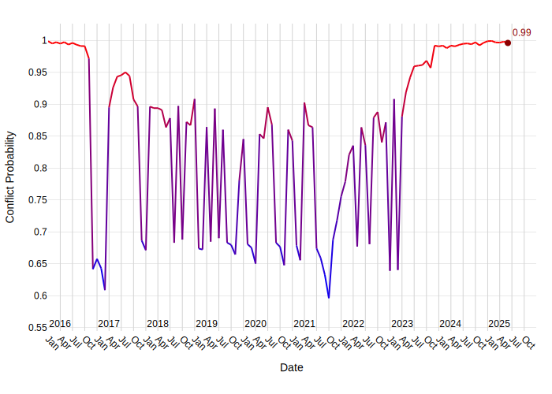

# Comprehensive Security Report: Sudan's Ongoing Conflict and Humanitarian Crisis

## 1. Overview

Sudan has been embroiled in a civil war since April 15, 2023, primarily between the Sudanese Armed Forces (SAF) and the paramilitary Rapid Support Forces (RSF) [1], [2]. This conflict erupted following a period of fragile peace that emerged after recent coups and two prior civil wars, significantly exacerbating an already dire humanitarian situation [1].The conflict's origins trace back to a power struggle between former allies, General Abdel Fattah al-Burhan, leader of the SAF and de facto head of state, and RSF General Mohamed Hamdan Dagalo (Hemedti) [1], [2], [3]. Both had collaborated in the 2019 overthrow of dictator Omar al-Bashir [1], [4] and the subsequent 2021 coup that toppled Sudan's interim government [1]. However, international pressure for a civilian transition led to Burhan's attempt to integrate the RSF into the national army, triggering Hemedti's violent revolt in mid-April 2023 [1]. The RSF itself was initially created by Omar al-Bashir as a border force designed for rapid problem neutralization [5].International efforts to mediate peace, including negotiations led by the United States and Saudi Arabia, have resulted in over a dozen failed ceasefires [1], [4]. Peace plans proposed by the African Union and other regional blocs have also been unsuccessful [1]. An Egypt-led conference in July 2023 established humanitarian corridors [1] but failed to resolve the conflict [1]. The Sudanese government cited the Intergovernmental Authority on Development (IGAD)'s engagement with RSF leader Hemedti as a reason for complicating diplomatic efforts [1], [5]. Currently, negotiations remain stalled due to a perceived lack of political will from both sides [1]. Gold sales by the RSF are primarily to the Emirates [5], which also played a strategic role in the ouster of Omar al-Bashir [5].The humanitarian crisis in Sudan is profound [5]. A spokesperson for the UN refugee agency (UNHCR) referred to Sudan as the world's largest and worst protection crisis [6]. Prior to the conflict, nearly 16 million people faced severe food insecurity, and an estimated 3.7 million were internally displaced, with Sudan also hosting approximately 1.3 million refugees, predominantly from South Sudan [1]. The ongoing conflict has led to an estimated death toll of over 150,000 people [5] and forcibly displaced more than twelve million people since April 2023, including over 7.7 million internally displaced and an estimated 4 million refugees [1]. This makes it the world’s largest and fastest-growing internal displacement crisis [1]. Over four million refugees have fled to neighboring countries [1], raising concerns about broader destabilization across the Horn of Africa and Sahel regions [1].

## 2. Key Security Events

### Recent Military Engagements and Territorial Control
- **Khartoum State:** On May 20, 2025, military sources reported that the Sudanese army had fully recaptured Khartoum State from the RSF militia, although an official stated the army was 'close' to full recapture, with fighting continuing in Omdurman [7, 8]. This followed earlier successes, such as on May 19, 2025, when SAF regained control of a significant portion of Omdurman - Al Salha [9], seizing a large quantity of RSF weapons [9] and causing an unspecified number of RSF casualties, with fatalities coded as 3 [9]. On April 15, 2025, clashes in Al Sufayra (Um Bada) saw SAF regain control of the village [10, 11], claiming to have killed tens of RSF fighters, with 3 fatalities recorded for this event [12, 13].
- **North Darfur:** Fighting remains intense in El Fasher, with warring military factions continuing clashes as of April 23, 2025 [14]. On the same day, RSF militia forces shelled Abu Shouk camp [15], and the Al-Quba [15] and Al-Nasr neighborhoods of El Fasher [15]. The Sudanese military claimed to have repelled an RSF attack attempting to push into northern El Fasher on April 18, 2025 [16]. Earlier, on April 11, 2025, RSF launched new strikes in El Fasher [17], prompting an artillery response from the army [17], with at least 20 people reported killed during RSF shelling [18]. On April 10, 2025, RSF briefly overtook Um Kadadah, a key town on the road to El Fasher, but control was later regained by Shugara [17]. Significant clashes occurred between RSF and Shugara-Berti in Umm Keddada on April 10, 2025 [19], resulting in 10 civilian fatalities [20] and the displacement of 3,500 households [21], with RSF looting civilians [22, 19] and Starlink networks [23].
- **White Nile State:** RSF has employed drone strikes, targeting a Sudanese military position in the Arshkool area on April 27, 2025 [24], and the army command in Kosti on April 29, 2025 [25].
- **South Kordofan:** On May 23, 2025, SAF, supported by Darfur Joint Forces/JSAMF, regained control of Dibebad (Al Quoz) from RSF [26], inflicting losses on RSF personnel and equipment [26], with 10 RSF fatalities [27] and 1 SAF fatality [28].
- **South Darfur:** Sudan army airstrikes targeted RSF positions in Nyala [29] and El Geneina areas of Darfur on May 11, 2025 [29].

### Civilian Impact and Human Rights Concerns
The conflict has been marked by severe human rights abuses, including reports of ethnic cleansing [5], sexual violence [1, 5], and mass killings, with significant involvement attributed to the RSF, particularly in Darfur [5, 30, 31]. The RSF's actions are linked to its precursor, the Janjaweed [5], which committed widespread atrocities in Darfur in 2003 [5]. The current war is also connected to old tensions [5], tribal divisions [5], and competition for resources [5, 4].

The ongoing violence has led to massive displacement, with people fleeing in droves to neighboring countries like Chad [5, 32, 33], Egypt [5], Kenya [5, 1], and Ethiopia [32, 5] due to unsafe conditions. While some areas, including parts of Khartoum [7], and Jazira [5], have reportedly been liberated, allowing some residents to return [5], the overall displacement crisis remains critical. Getting media reports out of Sudan has been challenging [5].

On June 28, 2025, a mine collapse in a desert area of River Nile state reportedly killed at least 50 people [34], with rescue efforts hampered by the remote location [34] and poor road conditions [34].

### United Nations Humanitarian Operations
The humanitarian situation is described by the World Food Program as "the world’s worst humanitarian crisis" [5], with over 24 million people facing crisis levels of hunger [1]. On April 21, 2025, the SLM/A-Nur declared a humanitarian emergency in their controlled areas of Jebel Marrah [35] and Tawila (North Darfur) [36, 37], following significant displacement to these areas due to clashes across Darfur states [33, 21]. Despite the severity, the crisis in Sudan receives less media attention compared to conflicts in Ukraine [5] or Gaza [5], partly due to a historical lack of international support for the African continent [5].

## 3. Forward Outlook

The security outlook for Sudan remains highly precarious, characterized by a stalled peace process and deep-seated trauma from ongoing atrocities [1, 5, 4, 38, 39]. Negotiations for a meaningful resolution remain stalled, with a perceived lack of political will from both the Sudan Armed Forces (SAF) and Rapid Support Forces (RSF) leadership [1]. However, the RSF leadership has actively hindered resolution efforts through actions such as formalizing a new governing coalition, engaging in general mobilization, threatening ethnic communities, besieging El Fasher, cutting off assistance, and shelling civilian areas [3, 40]. The RSF has committed extensive human rights abuses, including ethnic cleansing and sexual violence [5, 41, 42, 43, 44], which pose significant challenges for future reconciliation and reintegration into Sudanese society, with some experts deeming it "almost impossible" [5, 2]. The conflict's connection to old tensions, tribal divisions, and competition for resources suggests that even if the current fighting subsides, underlying drivers of instability will persist [1, 5, 4, 14]. The continued flow of external support to the warring parties, particularly the RSF's funding through gold sales to the Emirates, further complicates efforts to de-escalate the conflict [5, 45].

### Armed Conflict Probability Forecast (ConflictForecast)

According to ConflictForecast, there is a 99.61% estimated probability that Sudan will experience an outbreak of armed conflict within the next three months [14].

*This forecast reflects the likelihood that the country will exceed a threshold of 0.5 fatalities per one million inhabitants over the course of three months.*

The trend in armed conflict risk, 2016-2025.

### Subnational Perspective

#### Gedaref
No specific forward-looking information is available for Gedaref in the provided context.

#### Northern
No specific forward-looking information is available for Northern state in the provided context.

#### Blue Nile
No specific forward-looking information is available for Blue Nile state in the provided context.

#### Khartoum
The Sudan Armed Forces (SAF) claimed to have recaptured Khartoum State on May 20, 2025 [45, 7]. While there is a potential for the return of displaced populations to liberated areas within Khartoum [5], continued fighting in areas like Omdurman suggests that full security consolidation and increased stability may still be ongoing [7, 8].

#### River Nile
The renewal of the state of emergency on May 1, 2025, indicates ongoing insecurity in River Nile state [46, 47]. The recent mine collapse on June 28, 2025, with delayed rescue efforts [34], highlights persistent challenges related to safety and infrastructure [34, 48], suggesting that the region will continue to face instability and humanitarian concerns [34, 49].

#### West Darfur
Darfur is highlighted as an epicenter of violence and human rights abuses [39, 50]. No specific forward-looking information for West Darfur is provided. The deep trauma and historical tensions in the broader Darfur region suggest a challenging path to peace and reconciliation [5, 39, 2].

#### Sennar
No specific forward-looking information is available for Sennar in the provided context.

#### Central Darfur
No specific forward-looking information is available for Central Darfur in the provided context.

#### Aj Jazirah
Some areas in Aj Jazirah have been liberated, and people are beginning to return [5]. This suggests a cautiously optimistic outlook for localized stability and recovery, provided the broader conflict does not re-escalate in these areas.

## Sources
[1] Council on Foreign Relations: https://www.cfr.org/in-brief/what-extent-sudans-humanitarian-crisis, 2025-06-26
[2] Eurasia Review: https://www.eurasiareview.com/03072025-foreign-influence-is-fueling-the-war-in-sudan-analysis/, 2025-07-02
[3] Radio Tamazuj: https://www.radiotamazuj.org/en/news/article/sudan-rsfs-hemetti-to-lead-new-alliance, 2025-07-02
[4] The Citizen - Independent Journalism | Indian News | The Citizen: https://www.thecitizen.in/in-depth/sudan-the-scourge-of-violence-1157773, 2025-07-02
[5] TRT Global: https://trt.global/world/audio/26e5819f8900, 2025-07-02
[6] usmuslims.com: https://www.usmuslims.com/un-agencies-warn-of-deepening-hunger-crisis-for-sudanese-refugees-304739h.htm, 2025-07-01
[7] x.com/AJABreaking: x.com/AJABreaking/status/1924726433349566752, 2025-05-20
[8] x.com: x.com/hash_sudan/status/1924709230205981143, 2025-05-20
[9] Sudan: 19 May 2025
[10] sudan: https://www.crisisgroup.org/africa/horn-africa/sudan/267-sudan-country-analysis-may-2025, 15 April 2025
[11] sudan: https://www.crisisgroup.org/africa/horn-africa/sudan/on-15-april-2025-clashes-between-saf-and-rsf-continued-in-al-sufayra-um-bada-khartoum-with-saf-regaining-control-of-the-village, 2025-04-15
[12] sudan: https://www.crisisgroup.org/africa/horn-africa/sudan/2025-sudan-conflict-data, 2025-04-15
[13] sudan: https://www.crisisgroup.org/africa/horn-of-africa/sudan, 2025-04-15
[14] x.com: x.com/AlHadath/status/1915153899826069585, 2025-04-23
[15] t.me: https://t.me/AjaNews/372519, 2025-04-23
[16] sudanakhbar.com: https://www.sudanakhbar.com/1639894, 2025-04-18
[17] x.com/MUAMMAR_SUD: x.com/MUAMMAR_SUD/status/1910627006451941397, 2025-04-11
[18] x.com/AJABreaking: x.com/AJABreaking/status/1910539720326799427, 2025-04-11
[19] Sudan: 10 April 2025
[20] Sudan: https://www.crisiscleanup.org/data/sudan-conflict-tracker/, 10 April 2025
[21] alhamish.com: https://www.alhamish.com/%D9%86%D8%B2%D9%88%D8%AD-%D8%A3%D9%83%D8%AB%D8%B1-%D9%85%D9%86-450-%D8%A3%D9%84%D9%81-%D8%B4%D8%AE%D8%B5-%D8%A5%D9%84%D9%89-%D8%B7%D9%88%D9%8A%D9%84%D8%A9-%D8%AE%D9%84%D8%A7%D9%84-%D8%A3%D8%B3%D8%A8/, 2025-04-17
[22] Sudan: https://www.crisisgroup.org/africa/horn-africa/sudan/267, 10 April 2025
[23] sudanakhbar.com: https://www.sudanakhbar.com/1636663, 2025-04-08
[24] x.com/AJABreaking: x.com/AJABreaking/status/1916541074803396977, 2025-04-27
[25] x.com/AJABreaking: 2025-04-29
[26] Sudan: 23 May 2025
[27] sudan: https://www.securitydata.org/events/1000000000000000000000000000000000000000000000000000000000000000, 2025-05-23
[28] sudan: https://www.crisisgroup.org/africa/horn-africa/sudan/2025-05-23-saf-vs-rsf-clashes-dibebad-south-kordofan, 2025-05-23
[29] sudanakhbar.com: https://www.sudanakhbar.com/1647482, 2025-05-11
[30] x.com/AlArabiya_Brk: x.com/AlArabiya_Brk/status/1922934057437962508, 2025-05-15
[31] x.com/AJABreaking: x.com/AJABreaking/status/1941894307075576025, 2025-07-06
[32] Morning Star | The People’s Daily: https://morningstaronline.co.uk/article/sudanese-risk-worsening-hunger-civil-war, 2025-07-02
[33] The European Times News: https://europeantimes.news/2025/07/sudan-un-warns-of-soaring-displacement-and-looming-floods/, 2025-07-02
[34] proceso.hn: https://proceso.hn/mueren-al-menos-50-personas-al-derrumbarse-una-mina-de-oro-en-el-norte-de-sudan/, 2025-06-28
[35] Sudan: 21 April 2025
[36] sudan: https://www.aljazeera.com/news/2025/4/21/sudan-conflict-escalates-in-darfur-region, 2025-04-21
[37] sudan: x.com/ReliefIntl/status/1911075404934164868, 2025-04-12
[38] BMC Medical Education: https://bmcmededuc.biomedcentral.com/articles/10.1186/s12909-025-07457-4, 2025-07-01
[39] MSF UK: https://msf.org.uk/article/sudan-new-msf-report-documents-mass-atrocities-north-darfur, 2025-07-02
[40] UN News: https://news.un.org/en/story/2025/07/1165176, 2025-07-01
[41] x.com/AJA_Egypt: 2025-05-03
[42] x.com/MofaSudan: 2025-05-30
[43] x.com/AlArabiya_Brk: 2025-05-15
[44] x.com/MUAMMAR_SUD: 2025-04-11
[45] sudantribune.com: https://sudantribune.com/article301134/, 2025-05-20
[46] sudanakhbar.com: https://www.sudanakhbar.com/1662737, 2025-06-26
[47] sudanakhbar.com: https://www.sudanakhbar.com/1662737, 2025-05-01
[48] suna-sd.net: https://suna-sd.net/posts/agtmaaa-tary-llmoard-almaadny-lmtabaa-hadth-mngm-hoyd, 2025-06-29
[49] x.com/alrakoba1: 2025-04-25
[50] x.com/SDN154: 2025-04-21
[51] x.com/ReliefIntl: 2025-04-12
[52] newarab.com: https://www.newarab.com/news/rsf-attack-sudan-displacement-camp-darfur-kills-14, 2025-06-05
[53] reuters.com: https://www.reuters.com/world/africa/un-says-more-than-300-civilians-dead-sudans-north-darfur-2025-04-14/, 2025-04-14

---

# Metadata

**Generated on:** 2025-07-07 20:24:32

**Country:** Sudan

**Retriever used for report generation:** HybridCypher

**Forecast data path:** forecast_data_Sudan_2025-07-07-20-23-44.json