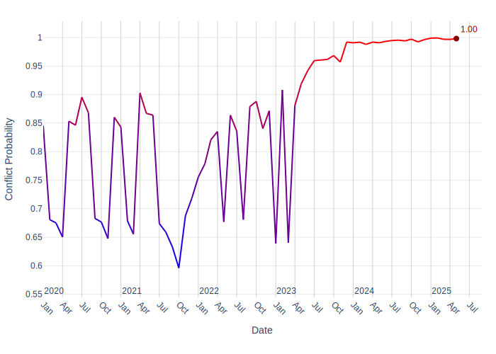
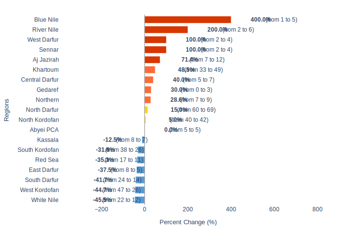

# Security Report - Sudan: Metadata

**Generated on:** 2025-07-02 16:30:54
**Retriever:** HybridCypher
**Configuration:**
- search_params: {'top_k': 5, 'ranker': 'linear', 'alpha': 0.5}
- graphrag_model: gemini-2.5-flash

---

# Sudan Security Report: Recent Developments and Forward Outlook

## 1. Overview

Sudan is currently embroiled in a two-year civil war, primarily characterized by conflict between the Sudanese army and the Rapid Support Force (RSF) [1, 2, 3, 4]. Recent security events underscore significant challenges, particularly concerning critical national infrastructure and the escalating humanitarian crisis [1, 5, 6].

## 2. Key Security Events

### Attacks on Critical Infrastructure and Energy Sector

Port Sudan has emerged as a major flashpoint, experiencing a large fire at multiple oil depots [1]. These incidents followed the first RSF paramilitary drone strikes in the city since the onset of the civil war [1]. The Sudanese civil defense reported that fires at major oil depots in government-controlled Port Sudan were brought "completely" under control after numerous RSF attacks on petroleum reserves [5]. Sudanese media also reported new drone strikes in unspecified areas within Port Sudan [6].

In response to these threats, the Sudanese government has drafted contingency plans to suspend the import and export of oil from South Sudan if the oil transit system is further compromised by RSF strikes, which have already impacted pump stations, depots, and port facilities on the Red Sea [7]. The risk to this system is deemed high, necessitating "fast track" contingency measures [7]. The RSF has been directly involved in attacks on fuel depots and petroleum reserves [8, 9], and an RSF drone also struck an ammunition depot in Port Sudan [10]. Defensive measures include anti-aircraft networks confronting drones and engaging in anti-aircraft fire [11, 12], with the Sudanese government also participating in drone interception efforts [13].

### Ground Clashes and Territorial Control

The conflict has seen significant ground engagements. RSF forces captured En Nahud, leading to incidents of looting, attacks on public buildings, and the killing of civilians [14]. This capture also involved the takeover of a prison and the subsequent release of inmates by the RSF in En Nahud [15, 16]. Despite these reports, the Sudanese government denied losing control of Nahud town [17].

The Sudanese army has reported gains against the RSF [18], and intense fighting has occurred for control of Khartoum State [19]. The army successfully recaptured Al-Khawi [20]. Clashes and fighting have also been reported in key urban centers such as Omdurman, Al-Khawi, and Al Fashir [21, 22, 23].

### United Nations Humanitarian Operations

United Nations agencies have been actively involved in humanitarian responses. The World Health Organization (WHO) facilitated the arrival of 2.9 million doses of oral vaccine against cholera in Port Sudan [24]. However, humanitarian efforts have been hampered by the conflict, as evidenced by an attack on an aid convoy involving UNICEF and the World Food Programme (WFP) [25, 26].

### Broader Humanitarian Impact

Beyond direct conflict, the humanitarian situation remains dire. A cholera outbreak has been confirmed, with the health ministry reporting 727 cases and 12 deaths [27]. The conflict has also impacted healthcare infrastructure, with officials reporting the closure of a main hospital in Old Fangak due to airstrikes [28]. The RSF also conducted a strike on a hospital [29]. The Sudanese government has initiated assessments of refugee conditions and undertaken evacuation efforts [30, 31].

### External Relations and Sanctions

The international community has responded to the conflict. The United States is set to impose sanctions on Sudan [32]. Furthermore, Sudan has accused the UAE of violating international conventions, citing reports of UAE ships cooperating with the RSF [33, 34]. A Sudanese general from Dubai was also reportedly involved in expelling staff [35].

## 3. Forward Outlook

The security situation in Sudan is expected to remain volatile, with the ongoing conflict between the Sudanese army and the RSF continuing to define the landscape. The vulnerability of critical infrastructure, particularly the oil transit systems, remains a significant concern, prompting the Sudanese government to prepare for potential disruptions [7].

### Armed Conflict Probability Forecast (Conflict Forecast)

According to [ConflictForecast](https://conflictforecast.org/), the predicted probability of armed conflict in Sudan in the next 3 months is of 99.81%.
*This prediction represents the risk that a country suffers an outbreak of armed conflict within the next three months, i.e. that the country goes from no fatalities to over 0.5 fatalities per one million inhabitants within a time horizon of three months.*
The following chart displays the armed conflict risk trend since 2020 until the present day:

### Subnational Perspective

Based on data available in July 2025, nine subnational ADM1 regions are classified as hotspots, indicating an expected increase of at least 25% in violent events in the short term:

#### Predicted Increase in Violent Events in the Short Term (ACLED)

[ACLED CAST](https://acleddata.com/conflict-alert-system/) predicts 9 ADM1 regions in Sudan to be hotspots for violent events in the next calendar month (August, 2025).
*An ADM1 region is considered to be a hotspot if the predicted increase in the number of violent events in the next month compared to the 3-month average is at least of 25%.*
The chart below shows regions with a predicted increase in violent events.

Considering the hotspot criteria, the following regions are expected to have a significant increase in violent events in August, 2025:
- **River Nile**: Average of 2 violent events in the last 3 months, forecasted 6 violent events in August, 2025 (0% increase compared to the average).
- **Aj Jazirah**: Average of 7 violent events in the last 3 months, forecasted 12 violent events in August, 2025 (0% increase compared to the average).
- **Central Darfur**: Average of 5 violent events in the last 3 months, forecasted 7 violent events in August, 2025 (0% increase compared to the average).
- **Blue Nile**: Average of 1 violent events in the last 3 months, forecasted 5 violent events in August, 2025 (0% increase compared to the average).
- **Gedaref**: Average of 0 violent events in the last 3 months, forecasted 3 violent events in August, 2025 (0% increase compared to the average).
- **Khartoum**: Average of 33 violent events in the last 3 months, forecasted 49 violent events in August, 2025 (0% increase compared to the average).
- **Northern**: Average of 7 violent events in the last 3 months, forecasted 9 violent events in August, 2025 (0% increase compared to the average).
- **Sennar**: Average of 2 violent events in the last 3 months, forecasted 4 violent events in August, 2025 (0% increase compared to the average).
- **West Darfur**: Average of 2 violent events in the last 3 months, forecasted 4 violent events in August, 2025 (0% increase compared to the average).
#### River Nile
This region is predicted to see a 200.0% increase in violent events, rising from an average of 2.0 to 6.0 in the short term.

#### Aj Jazirah
Expected to experience a 71.43% increase in violent events, with the predicted number rising from an average of 7.0 to 12.0.

#### Central Darfur
Forecasted to have a 40.0% increase in violent events, from an average of 5.0 to 7.0.

#### Blue Nile
Anticipated to have a substantial 400.0% increase in violent events, with the predicted number rising from an average of 1.0 to 5.0.

#### Gedaref
Projected to see a 30.0% increase in violent events, from an average of 0.0 to 3.0.

#### Khartoum
Expected to experience a 48.48% increase in violent events, with the predicted number rising from an average of 33.0 to 49.0.

#### Northern
Forecasted to have a 28.57% increase in violent events, from an average of 7.0 to 9.0.

#### Sennar
Predicted to see a 100.0% increase in violent events, rising from an average of 2.0 to 4.0.

#### West Darfur
Expected to experience a 100.0% increase in violent events, with the predicted number rising from an average of 2.0 to 4.0.

## 4. Sources

- [1] Owen, Editor's note (social media)
- [2] kg_rels (RSF militants - CONFRONTED_WITH() -> army)
- [3] kg_rels (RSF forces - CONFRONTED_WITH() -> army)
- [4] kg_rels (RSF - CONFRONTED_WITH() -> army)
- [5] Sudanese civil defense
- [6] Sudanese media
- [7] Sarah, Editor's note (Radio Tamazuj)
- [8] kg_rels (Rapid Support Force - PARTICIPATED_IN() -> attacks on fuel depots)
- [9] kg_rels (RSF - PARTICIPATED_IN() -> RSF attacks on petroleum reserves)
- [10] kg_rels (RSF - PARTICIPATED_IN() -> RSF drone struck ammunition depot)
- [11] kg_rels (anti-aircraft networks - CONFRONTED_WITH() -> drones)
- [12] kg_rels (anti-aircraft networks - PARTICIPATED_IN() -> Anti-aircraft fire)
- [13] kg_rels (Sudanese government - PARTICIPATED_IN() -> Drone Interception)
- [14] kg_rels (RSF forces - PARTICIPATED_IN() -> Capture of En Nahud, looting, attacking public buildings, killing civilians)
- [15] kg_rels (Prison Capture by RSF - HAPPENED_IN() -> En Nahud)
- [16] kg_rels (Inmate Release by RSF - HAPPENED_IN() -> En Nahud)
- [17] kg_rels (Sudanese government - PARTICIPATED_IN() -> Denial of reports regarding control loss of Nahud town)
- [18] kg_rels (Sudanese government - PARTICIPATED_IN() -> Army gains against RSF)
- [19] kg_rels (army - PARTICIPATED_IN() -> Battle for control of Khartoum State)
- [20] kg_rels (Recapture of Al-Khawi - HAPPENED_IN() -> Al-Khawi)
- [21] kg_rels (fighting - HAPPENED_IN() -> Omdurman)
- [22] kg_rels (fighting - HAPPENED_IN() -> Al-Khawi)
- [23] kg_rels (fighting - HAPPENED_IN() -> Al Fashir)
- [24] kg_rels (WHO - PARTICIPATED_IN() -> Arrival of 2.9 million doses of oral vaccine against cholera)
- [25] kg_rels (UNICEF - PARTICIPATED_IN() -> attack on aid convoy)
- [26] kg_rels (WFP - PARTICIPATED_IN() -> attack on aid convoy)
- [27] kg_rels (health ministry - PARTICIPATED_IN() -> cholera-related deaths and infections, 727 cholera cases, 12 deaths)
- [28] kg_rels (officials - PARTICIPATED_IN() -> closure of main hospital; bombing of its hospital - HAPPENED_IN() -> Old Fangak)
- [29] kg_rels (RSF - PARTICIPATED_IN() -> RSF strike on hospital)
- [30] kg_rels (Sudanese government - PARTICIPATED_IN() -> assessment of refugee conditions)
- [31] kg_rels (Sudanese government - PARTICIPATED_IN() -> evacuations)
- [32] kg_rels (US - CONFRONTED_WITH(US to impose sanctions on Sudan) -> Sudan)
- [33] kg_rels (Sudan - CONFRONTED_WITH(Sudan accuses UAE of violating international convention) -> UAE)
- [34] kg_rels (UAE ships - COOPERATED_WITH() -> RSF)
- [35] kg_rels (Sudanese general - IS_FROM() -> Dubai; Sudanese general - PARTICIPATED_IN() -> expelling staff)

---

*Report generated using GraphRAG pipeline at 2025-07-02 16:30:54*