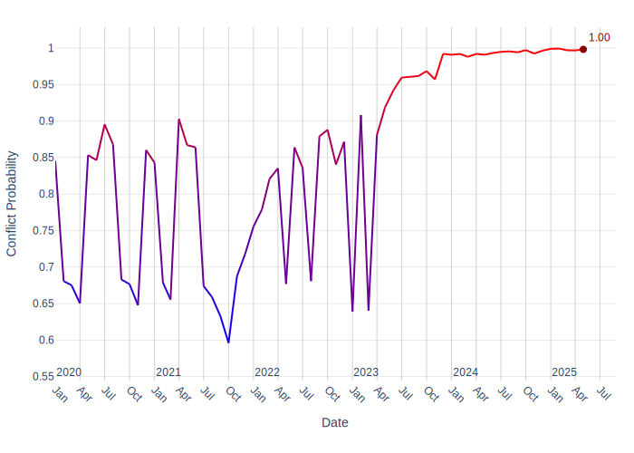
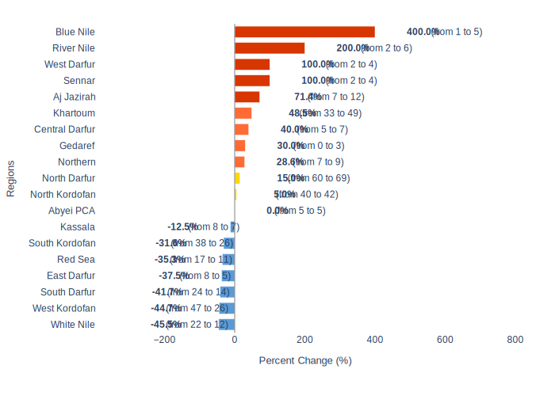

# Security Report - Sudan: Metadata

**Generated on:** 2025-07-02 17:03:22
**Retriever:** HybridCypher
**Configuration:**
- search_params: {'top_k': 5, 'ranker': 'linear', 'alpha': 0.5}
- graphrag_model: gemini-2.5-flash

---

# Sudan Security Report: Escalating Conflict and Humanitarian Challenges

## 1. Overview
Sudan is currently experiencing a protracted civil war, which has significantly impacted the country's stability and security landscape. The conflict, now in its second year, continues to drive political instability and humanitarian crises across various regions [1].

## 2. Key Security Events

### Escalation of Hostilities in Port Sudan
Port Sudan, a critical strategic location for the Sudanese government, has recently become a focal point of the conflict. The city experienced its first Rapid Support Force (RSF) paramilitary drone strikes, marking a significant escalation in the two-year civil war [1]. These attacks led to a large fire at multiple oil depots, which was subsequently brought under control by the Sudanese civil defense [2]. Sudanese media also reported new drone strikes on unspecified areas within Port Sudan [3].

### Impact on Oil Transit System
The RSF drone strikes have directly impacted critical oil transit infrastructure, including pump stations, depots, and port facilities on the Red Sea [4]. In response to these disruptions, the Sudanese government has drafted contingency plans to suspend the import and export of oil from South Sudan. The government has warned South Sudan that further compromise of the transportation system would prevent the facilitation of South Sudanese oil exports from Port Sudan, describing the risk as high and the contingency plans as "fast track" [4, 5].

### Humanitarian and Health Concerns
The ongoing conflict continues to exacerbate humanitarian challenges and public health crises. The health ministry has reported 727 cholera cases and 12 deaths, indicating a severe public health situation [6]. In a positive development for humanitarian efforts, 2.9 million doses of oral vaccine against cholera arrived in Port Sudan, facilitated by the World Health Organization (WHO) [7]. However, aid operations remain vulnerable, as evidenced by an attack on an aid convoy involving UNICEF and WFP [8].

## 3. Forward Outlook

### Armed Conflict Probability Forecast (Conflict Forecast)

According to [ConflictForecast](https://conflictforecast.org/), the predicted probability of armed conflict in Sudan in the next 3 months is of 99.81%.

*This prediction represents the risk that a country suffers an outbreak of armed conflict within the next three months, i.e. that the country goes from no fatalities to over 0.5 fatalities per one million inhabitants within a time horizon of three months.*

The following chart displays the armed conflict risk trend since 2020 until the present day:

### Subnational Perspective
Based on data available in July 2025, nine subnational ADM1 regions in Sudan are predicted to experience a significant increase in violent events, defined as an increase of at least 25% in the short term. These regions are identified as conflict hotspots:

#### Predicted Increase in Violent Events in the Short Term (ACLED)

[ACLED CAST](https://acleddata.com/conflict-alert-system/) predicts 9 ADM1 regions in Sudan to be hotspots for violent events in the next calendar month (August, 2025).

*An ADM1 region is considered to be a hotspot if the predicted increase in the number of violent events in the next month compared to the 3-month average is at least of 25%.*

The chart below shows regions with a predicted change in violent events.

Considering the hotspot criteria, the following regions are expected to have a significant increase in violent events in August, 2025:

| Region | Avg. # Violent Events (3 months) | Forecaste # Violent Events | % Increase |
|---|---|---|---|
| Northern | 7 | 9 | 28.6% |
| Central Darfur | 5 | 7 | 40.0% |
| Aj Jazirah | 7 | 12 | 71.4% |
| Sennar | 2 | 4 | 100.0% |
| River Nile | 2 | 6 | 200.0% |
| Gedaref | 0 | 3 | 30.0% |
| Blue Nile | 1 | 5 | 400.0% |
| Khartoum | 33 | 49 | 48.5% |
| West Darfur | 2 | 4 | 100.0% |
#### Northern
The Northern state is projected to see an increase in violent events, with a predicted 9.0 events in the short term, up from an average of 7.0 in the last three months, representing a 28.57% increase.

#### Central Darfur
Central Darfur is expected to experience a 40.0% increase in violent events, with a forecast of 7.0 events compared to the previous average of 5.0.

#### Aj Jazirah
Aj Jazirah is anticipated to have a substantial increase of 71.43% in violent events, with a prediction of 12.0 events from an average of 7.0.

#### Sennar
Sennar is forecast to double its violent events, with a 100.0% increase from an average of 2.0 to a predicted 4.0 events.

#### River Nile
The River Nile state is expected to see a significant surge, with a 200.0% increase in violent events, rising from an average of 2.0 to a predicted 6.0 events.

#### Gedaref
Gedaref is projected to experience a 30.0% increase, with a forecast of 3.0 violent events from a previous average of 0.0.

#### Blue Nile
Blue Nile is predicted to have the most substantial increase, with a 400.0% rise in violent events, from an average of 1.0 to a predicted 5.0 events.

#### Khartoum
Khartoum, a major conflict zone, is expected to see a 48.48% increase in violent events, with a forecast of 49.0 events from an average of 33.0.

#### West Darfur
West Darfur is also forecast to double its violent events, with a 100.0% increase from an average of 2.0 to a predicted 4.0 events.

## 4. Sources
[1] Owen, Editor's note.
[2] Sudanese civil defense.
[3] Sudanese media.
[4] Sarah, Editor's note.
[5] Radio Tamazuj.
[6] health ministry.
[7] WHO.
[8] UNICEF, WFP.

---

*Report generated using GraphRAG pipeline at 2025-07-02 17:03:22*