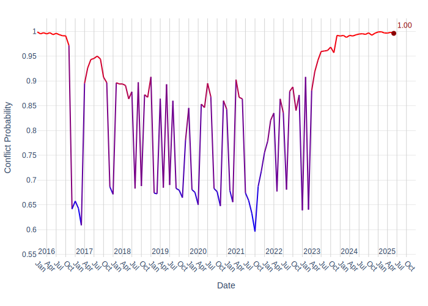
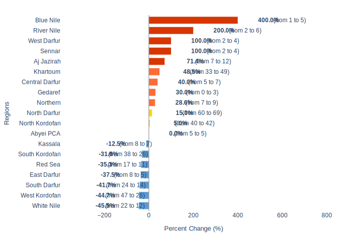

# Security Report - Sudan: Metadata

**Generated on:** 2025-07-02 22:23:44

**Retriever:** HybridCypher

**Forecast data path:** forecast_data_Sudan_2025-07-02-22-23-16.json

**Configuration:**
- search_params: {'top_k': 20, 'ranker': 'linear', 'alpha': 0.5}
- graphrag_model: gemini-2.5-flash

---

# Sudan Security Report: Escalating Conflict and Regional Instability

## 1. Overview
The security situation in Sudan remains highly volatile, characterized by intense conflict between the Sudan Armed Forces (SAF) and the Rapid Support Forces (RSF) [1, 2]. This conflict has led to significant instability across key regions, including Khartoum State, Darfur, and critical infrastructure in Port Sudan [1, 2, 3]. The ongoing hostilities have resulted in civilian casualties and widespread disruption, impacting essential services and regional stability [2, 4]. Political instability is also noted in neighboring South Sudan, with a recent government reshuffle of key state government positions in Upper Nile, Central Equatoria, and Warrap states [5].

## 2. Key Security Events

### Intensified Fighting in Khartoum and Omdurman
The Sudan army has launched a "large-scale operation" aimed at reclaiming all of Khartoum State from the RSF [1]. Despite claims of being "close" to recapturing the entire state, fighting persists, particularly in the south and west of Omdurman [1]. Explosions and clashes have been reported in Omdurman as the army continues its efforts to dislodge the RSF from remaining positions [6]. The University of Khartoum in Omdurman has been targeted by RSF explosive drones [7].

### Drone Attacks and Infrastructure Threats in Port Sudan
Port Sudan has experienced a wave of RSF paramilitary drone attacks, leading to the suspension of all flights at its airport [3, 8]. These attacks have caused significant fires at major oil depots, which the Sudanese civil defense has since brought "completely" under control [9, 10]. Further drone strikes have been reported on unspecified areas in Port Sudan, with air defense systems reportedly active [11, 12]. A drone attack reportedly targeted a naval base in Port Sudan, following earlier incidents of smoke and anti-aircraft fire [13]. The Sudanese military reported that a drone attack on Port Sudan targeted civilian facilities, including an air base and a cargo warehouse, with unverified reports of power outages in parts of the city [14]. A five-drone attack on Port Sudan International Airport was also reported [15]. In response to these threats, the Sudanese government has drafted contingency plans to suspend the import and export of oil from South Sudan if the oil transit system, including pump stations, depots, and port facilities on the Red Sea, is further compromised by RSF strikes [16].

### Conflict in Darfur and Other Regions
Army airstrikes have targeted Rapid Support Force positions in Nyala and El Geneina areas of Darfur [17]. Near El Fasher, North Darfur, RSF drone and artillery attacks resulted in seven people killed and 15 injured, as fighting continues for control of the region [2]. A drone attack was reported on Atbara in River Nile state [18]. The Sudan People's Liberation Movement–North (SPLM-N) has accused the military of burning eight villages in the Heiban area of South Kordofan in early May [19]. Three Sudanese armed groups have joined forces to form a militia to protect the Um Gargour eastern border area with Eritrea [20].

### United Nations Humanitarian Operations
The World Health Organization (WHO) facilitated the arrival of 2.9 million doses of oral vaccine against cholera in Port Sudan [21]. Aid convoys from UNICEF and WFP have been attacked [22].

## 3. Forward Outlook

### Armed Conflict Probability Forecast (Conflict Forecast)

According to [ConflictForecast](https://conflictforecast.org/), the predicted probability of armed conflict in Sudan in the next 3 months is of 99.61%.

*This prediction represents the risk that a country suffers an outbreak of armed conflict within the next three months, i.e. that the country goes from no fatalities to over 0.5 fatalities per one million inhabitants within a time horizon of three months.*

The following chart displays the armed conflict risk trend since 2020 until the present day:

### Subnational Perspective
Based on data available in July 2025, nine ADM1 regions are predicted to be conflict hotspots, with an expected increase of at least 25% in violent events in the short term.

#### Predicted Increase in Violent Events in the Short Term (ACLED)

[ACLED CAST](https://acleddata.com/conflict-alert-system/) predicts 9 ADM1 regions in Sudan to be hotspots for violent events in the next calendar month (August, 2025).

*An ADM1 region is considered to be a hotspot if the predicted increase in the number of violent events in the next month compared to the 3-month average is at least of 25%.*

The chart below shows regions with a predicted change in violent events.

Considering the hotspot criteria, the following regions are expected to have a significant increase in violent events in August, 2025:

| Region | Avg. # Violent Events (3 months) | Forecasted # Violent Events | % Increase |
|---|---|---|---|
| River Nile | 2 | 6 | 200.0% |
| Aj Jazirah | 7 | 12 | 71.4% |
| Gedaref | 0 | 3 | 30.0% |
| Sennar | 2 | 4 | 100.0% |
| Khartoum | 33 | 49 | 48.5% |
| Blue Nile | 1 | 5 | 400.0% |
| Central Darfur | 5 | 7 | 40.0% |
| Northern | 7 | 9 | 28.6% |
| West Darfur | 2 | 4 | 100.0% |
#### River Nile
The River Nile state is projected to see a significant increase in violent events, from an average of 2.0 in the last three months to a predicted 6.0, representing a 200.0% increase [23].

#### Aj Jazirah
Aj Jazirah is expected to experience a substantial rise in violence, with predicted events increasing from an average of 7.0 to 12.0, a 71.43% increase [23].

#### Gedaref
Gedaref, which had no reported violent events in the last three months, is predicted to have 3.0 events, indicating a 30.0% increase [23].

#### Sennar
Sennar is forecast to double its violent events, from an average of 2.0 to 4.0, a 100.0% increase [23].

#### Khartoum
Khartoum, already a major conflict zone, is predicted to see an increase from an average of 33.0 violent events to 49.0, a 48.48% increase [23].

#### Blue Nile
The Blue Nile state is expected to witness a dramatic surge in violence, with predicted events increasing from an average of 1.0 to 5.0, a 400.0% increase [23].

#### Central Darfur
Central Darfur is projected to have a moderate increase in violent events, from an average of 5.0 to 7.0, a 40.0% increase [23].

#### Northern
The Northern state is predicted to experience an increase in violent events from an average of 7.0 to 9.0, a 28.57% increase [23].

#### West Darfur
West Darfur is forecast to double its violent events, from an average of 2.0 to 4.0, a 100.0% increase [23].

## 4. Sources
[1] Sudan army official, Al Jazeera.
[2] Sudan's army.
[3] Al Jazeera.
[4] Owen, Editor's note.
[5] president.
[6] Al Jazeera.
[7] Al Jazeera.
[8] Al Jazeera.
[9] Owen, Editor's note.
[10] Sudanese civil defense.
[11] Sudanese media.
[12] Sudanese media.
[13] AFP, James, Editor's note.
[14] Sudanese military.
[15] Al Jazeera.
[16] Sarah, Editor's note, Radio Tamazuj.
[17] local media.
[18] Sudanese media.
[19] Sudan People's Liberation Movement–North.
[20] Sudanese government.
[21] WHO.
[22] UNICEF, WFP.
[23] Data available in July, 2025.

---

*Report generated using GraphRAG pipeline at 2025-07-02 22:23:44*