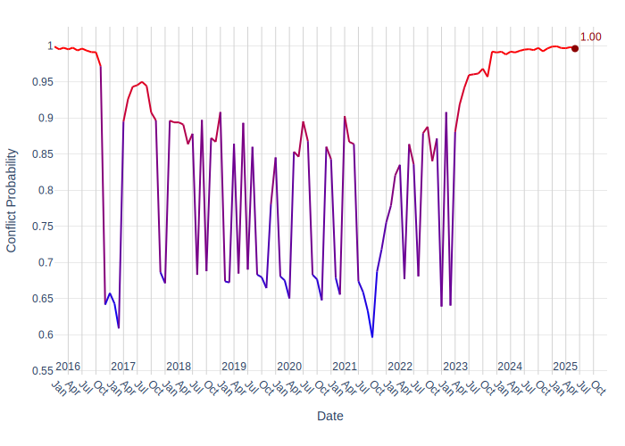
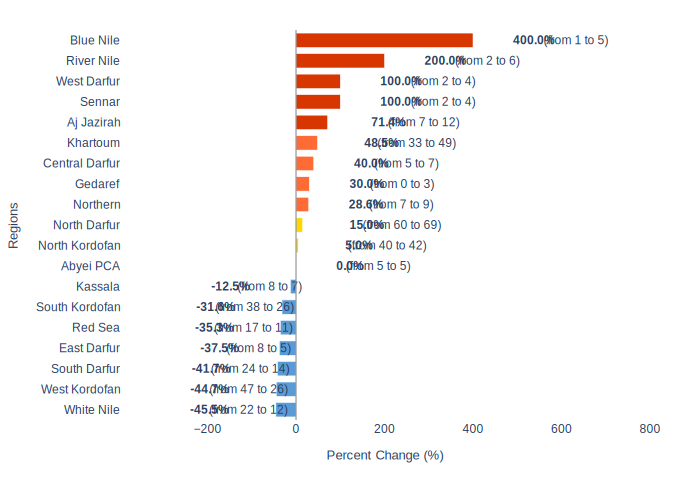

# Security Report - Sudan: Metadata

**Generated on:** 2025-07-02 23:11:09

**Retriever:** HybridCypher

**Forecast data path:** forecast_data_Sudan_2025-07-02-23-10-42.json

**Configuration:**
- search_params: {'top_k': 20, 'ranker': 'linear', 'alpha': 0.5}
- graphrag_model: gemini-2.5-flash

---

# Sudan Security Report: Escalating Conflict and Regional Instability

## 1. Overview
Sudan continues to experience a severe and escalating security crisis, primarily driven by the ongoing conflict between the Sudanese Armed Forces (SAF) and the Rapid Support Forces (RSF). Recent events indicate a broadening of the conflict's geographical scope and an intensification of hostilities, particularly through the increased use of drone warfare. Key areas of engagement include Khartoum State, Darfur, and the strategically vital Port Sudan. The conflict has resulted in significant civilian casualties, widespread destruction of infrastructure, and a deepening humanitarian crisis. Political instability also persists, with reports of reshuffles in South Sudan's state governments amidst the regional turmoil [1].

### Current Conflict Dynamics
The conflict is characterized by intense fighting for control of key urban centers and strategic infrastructure. The Sudanese army is engaged in large-scale operations to reclaim territories, while the RSF continues to employ drone and artillery attacks, targeting both military and civilian facilities. The use of drones by the RSF has become a prominent feature, impacting critical infrastructure such as airports, oil depots, and naval bases [2, 3, 4].

## 2. Key Security Events

### Intensified Fighting in Khartoum State
The Sudanese army has reported ongoing "large-scale operations" aimed at reclaiming all of Khartoum State from the RSF [5]. While military sources have indicated that Khartoum State has been largely recaptured, fighting persists, particularly in the south and west of Omdurman [6, 7]. Explosions and clashes have been reported in Omdurman as the army works to dislodge the RSF from remaining positions [8]. The RSF has also reportedly targeted the University of Khartoum in Omdurman with explosive drones [9].

### Strategic Attacks on Port Sudan
Port Sudan, a critical Red Sea port and the country's main economic gateway, has been subjected to a wave of RSF paramilitary drone attacks [10]. These attacks have led to the suspension of all flights at Port Sudan airport [10] and caused large fires at multiple oil depots [11]. The Sudanese civil defense has reported that these fires are now "completely" under control [12]. Further drone strikes have been reported targeting civilian facilities, including an air base and a cargo warehouse, with unverified reports of power outages in parts of the city [13]. A naval base in Port Sudan was also reportedly hit by a drone attack [14]. The Sudanese government has drafted contingency plans to suspend the import and export of oil from South Sudan in the event of further RSF strikes destabilizing the oil transit system, which has already seen impacts on pump stations, depots, and port facilities [15].

### Conflict in Darfur and Other Regions
In Darfur, the Sudanese army has conducted airstrikes targeting RSF positions in Nyala and El Geneina [16]. Near El Fasher in North Darfur, RSF drone and artillery attacks reportedly killed seven people and injured 15 more as fighting continues for control of the region [17]. Beyond Darfur, a drone attack was reported on Atbara in River Nile state [18]. The RSF also attacked the city of Nahud in Sudan's South Kordofan province [19]. Separately, the Sudan People's Liberation Movement–North (SPLM-N) militant group accused the military of burning eight villages in the Heiban area of South Kordofan in early May [20].

### Emergence of New Armed Groups
In response to the deteriorating security situation, three Sudanese armed groups have reportedly joined forces to form a militia aimed at protecting Sudan's Um Gargour eastern border area with Eritrea [21].

### United Nations Humanitarian Operations
The ongoing conflict has severely impacted humanitarian efforts. There are reports of an attack on an aid convoy, with UNICEF and WFP participating in the convoy [22]. Furthermore, the WHO has facilitated the arrival of 2.9 million doses of oral vaccine against cholera in Port Sudan, highlighting the public health challenges exacerbated by the conflict [23].

## 3. Forward Outlook

The security situation in Sudan is expected to remain highly volatile in the short term, with continued clashes between the SAF and RSF. The strategic importance of Khartoum and Port Sudan suggests that these areas will remain focal points of intense conflict. The increasing sophistication of RSF attacks, particularly with drones, poses a significant threat to critical infrastructure and civilian populations. The potential disruption of oil transit from South Sudan through Port Sudan could have severe economic repercussions for both countries.

### Armed Conflict Probability Forecast (Conflict Forecast)

According to [ConflictForecast](https://conflictforecast.org/), the predicted probability of armed conflict in Sudan in the next 3 months is of 99.61%.

*This prediction represents the risk that a country suffers an outbreak of armed conflict within the next three months, i.e. that the country goes from no fatalities to over 0.5 fatalities per one million inhabitants within a time horizon of three months.*

The following chart displays the armed conflict risk trend since 2020 until the present day:

### Subnational Perspective
Based on data available in July 2025, nine subnational ADM1 regions are predicted to experience a significant increase in violent events, classifying them as conflict hotspots. The projected increases underscore the widespread nature of the conflict and the potential for further destabilization across the country.

#### Predicted Increase in Violent Events in the Short Term (ACLED)

[ACLED CAST](https://acleddata.com/conflict-alert-system/) predicts 9 ADM1 regions in Sudan to be hotspots for violent events in the next calendar month (August, 2025).

*An ADM1 region is considered to be a hotspot if the predicted increase in the number of violent events in the next month compared to the 3-month average is at least of 25%.*

The chart below shows regions with a predicted change in violent events.

Considering the hotspot criteria, the following regions are expected to have a significant increase in violent events in August, 2025:

| Region | Avg. # Violent Events (3 months) | Forecasted # Violent Events | % Increase |
|---|---|---|---|
| West Darfur | 2 | 4 | 100.0% |
| River Nile | 2 | 6 | 200.0% |
| Khartoum | 33 | 49 | 48.5% |
| Northern | 7 | 9 | 28.6% |
| Sennar | 2 | 4 | 100.0% |
| Aj Jazirah | 7 | 12 | 71.4% |
| Blue Nile | 1 | 5 | 400.0% |
| Central Darfur | 5 | 7 | 40.0% |
| Gedaref | 0 | 3 | 30.0% |
#### West Darfur
West Darfur is projected to see a 100% increase in violent events, with the predicted number rising from an average of 2.0 events in the last three months to 4.0 events in the short term. This indicates a significant escalation of conflict in the region.

#### River Nile
The River Nile state is forecast to experience a 200% increase in violent events, with the predicted number rising from an average of 2.0 to 6.0 events. This substantial increase suggests a heightened risk of instability in an area previously less affected by direct conflict.

#### Khartoum
Khartoum, the capital, is expected to witness a 48.48% increase in violent events, with the predicted number rising from an average of 33.0 to 49.0 events. This indicates continued intense fighting and instability in the metropolitan area.

#### Northern
The Northern state is projected to see a 28.57% increase in violent events, with the predicted number rising from an average of 7.0 to 9.0 events. This modest but notable increase suggests a growing security concern in this region.

#### Sennar
Sennar is forecast to experience a 100% increase in violent events, with the predicted number rising from an average of 2.0 to 4.0 events. This significant escalation points to a deteriorating security environment.

#### Aj Jazirah
Aj Jazirah is projected to see a 71.42% increase in violent events, with the predicted number rising from an average of 7.0 to 12.0 events. This substantial increase highlights a worsening security situation in the region.

#### Blue Nile
The Blue Nile state is forecast to experience a dramatic 400% increase in violent events, with the predicted number rising from an average of 1.0 to 5.0 events. This indicates a severe and rapid deterioration of security.

#### Central Darfur
Central Darfur is projected to see a 40% increase in violent events, with the predicted number rising from an average of 5.0 to 7.0 events. This suggests a continued and intensifying conflict in the Darfur region.

#### Gedaref
Gedaref is forecast to experience a 30% increase in violent events, with the predicted number rising from an average of 0.0 to 3.0 events. While starting from a low base, this indicates the emergence of new security challenges in the area.

## 4. Sources
[1] President of South Sudan. "South Sudan's president announces sweeping reshuffle of key state government positions in Upper Nile, Central Equatoria, and Warrap states amid increasing political instability."
[2] Al Jazeera. "All flights suspended at airport in Port Sudan, Sudan, following wave of RSF paramilitary drone attacks in the city overnight."
[3] Sudanese media. "Sudanese media reports new drone strikes on unspecified areas in Port Sudan."
[4] AFP, military source. "Another drone attack is underway at a naval base in Port Sudan."
[5] Sudan army official. "Sudan army official says 'large-scale operation' ongoing to reclaim all of Khartoum state as fighting with RSF continues in south and west of Omdurman."
[6] Al Jazeera, military sources. "Khartoum State, Sudan, has been recaptured in full from the RSF militia by the army."
[7] Official. "Sudan army was 'close' to recapturing all of Khartoum State, but there was also still fighting reported in Omdurman."
[8] Al Jazeera. "Explosions, clashes reported in Omdurman, Sudan, as army says operation underway to drive RSF from remaining positions in Khartoum State."
[9] Al Jazeera, sources. "Rapid Support Forces 'target' University of Khartoum in Omdurman, Sudan, with explosive drones."
[10] Al Jazeera. "All flights suspended at airport in Port Sudan, Sudan, following wave of RSF paramilitary drone attacks in the city overnight."
[11] Owen, Editor's note. "Images circulating on social media of a large fire burning at multiple oil depots in Port Sudan, Sudan."
[12] Sudanese civil defense. "Sudanese civil defense says all fires at major oil depots in government-controlled Port Sudan are now 'completely' under control following numerous RSF attacks on petroleum reserves."
[13] Sudan army official. "Sudanese military, citing official, reports drone attack on Port Sudan targeted civilian facilities including air base and a cargo warehouse; unverified reports claim power outages in parts of city."
[14] AFP, military source. "Another drone attack is underway at a naval base in Port Sudan."
[15] Radio Tamazuj, Editor's note. "Local media is reporting that the Sudanese government has drafted contingency plans to suspend the import and export of oil from South Sudan in the event of further RSF strikes to destabilize the oil transit system."
[16] Local media. "Sudan army airstrikes target Rapid Support Force positions in Nyala and El Geneina areas of Darfur."
[17] Sudan army, sources. "Sudan's army says seven people killed, 15 more injured in RSF drone and artillery attacks near El Fasher as fighting continues for control of North Darfur."
[18] Sudanese media. "Sudanese media reports drone attack on Atbara in River Nile state."
[19] Al Jazeera, military source. "Rapid Support Forces attack city of Nahud in Sudan's South Kordofan province."
[20] Sudan People's Liberation Movement–North. "Sudan People's Liberation Movement–North militant group accuses military of burning in early May eight villages in the Heiban area of South Kordofan."
[21] Sudanese government. "Three Sudanese armed groups join forces to form militia to protect Sudan's Um Gargour eastern border area with Eritrea."
[22] UNICEF, WFP. "attack on aid convoy."
[23] WHO. "Arrival of 2.9 million doses of oral vaccine against cholera."

---

*Report generated using GraphRAG pipeline at 2025-07-02 23:11:09*