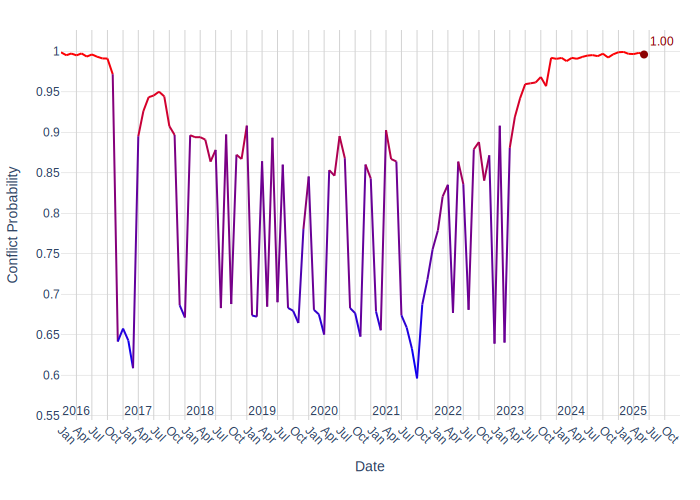
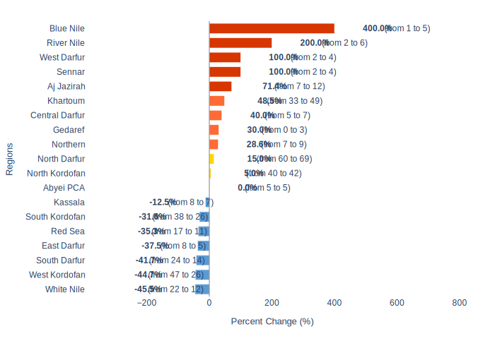

# Sudan Security Report: Recent Developments and Forward Outlook

## 1. Overview
Sudan continues to experience a complex and volatile security situation, primarily driven by the ongoing conflict between the Sudanese Armed Forces (SAF) and the Rapid Support Forces (RSF). This conflict has seen widespread fighting across multiple states, including North Darfur, White Nile, River Nile, Blue Nile, Khartoum, South Darfur, and Red Sea. The involvement of other armed groups, such as the Sudan Founding Alliance (SFA), which includes elements of the RSF and the Sudan People's Liberation Movement-North (SPLM-N-Abdelaziz), further complicates the landscape. Recent events indicate continued military engagements, including drone strikes and ground clashes, alongside significant humanitarian and socio-economic impacts on the civilian population.

## 2. Key Security Events

### Intensified Clashes and Territorial Control
The conflict has been marked by persistent and often intense clashes across various regions. In North Darfur, fighting has continued in multiple parts of El Fasher, with reports of ongoing clashes in Zamzam Camp between RSF paramilitary and government forces [7, 8, 9]. The RSF has reportedly shelled civilian areas, including Abu Shouk camp and the Al-Quba and Al-Nasr neighborhoods of El Fasher [10]. The Sudan Liberation Movement, a rebel group, has called for army assistance in El Fasher due to continued paramilitary bombing, affecting nearby displacement camps [13]. The RSF also claimed control over Zamzam camp amid reports of clashes and large-scale displacement [19], and officials reported at least 14 people killed after an RSF militia attack on a camp in El Fasher [17]. Earlier reports indicated RSF launching new strikes in El Fasher, prompting an army response with artillery [16].

Drone attacks have become a prominent feature of the conflict. In White Nile State, the RSF launched drone strikes on Sudanese military positions in the Arshkool area [4] and targeted the army command in Kosti [11]. Explosions near oil depots in Kosti were also reported [15]. The River Nile state also experienced a drone attack on Atbara [1]. In the Red Sea state, a large fire at multiple oil depots in Port Sudan followed a series of RSF paramilitary drone strikes, marking the first such attacks in the city during the civil war [18].

The SAF has made efforts to regain control of territories. In Blue Nile state, SAF clashed with the SFA (associated with RSF and SPLM-N-Abdelaziz) in Baldugu (Bau), successfully regaining control of the area, which led to the RSF withdrawing to South Sudan. In Khartoum, military sources indicated that Khartoum State had been recaptured in full from the RSF militia by the army, though fighting was still reported in Omdurman [12]. Internal conflicts within the RSF were also noted, with two RSF groups clashing in Taiyba Al Nile market in Nyala, South Darfur, resulting in many civilian injuries.

### United Nations Humanitarian Operations
The conflict has severely impacted humanitarian efforts. An aid convoy carrying life-saving supplies, operated by the World Food Programme (WFP) and UNICEF, was attacked near Al Koma in North Darfur. Five members were killed, several more injured, and multiple trucks were burned [20]. This incident highlights the extreme dangers faced by humanitarian personnel and the challenges in delivering aid to affected populations.

### Political and Economic Developments
On the political front, Sudan's rebel RSF formed a political alliance with the Sudan People’s Liberation Movement-North and other groups, aiming to govern areas under its control, primarily in Darfur [2]. Economically, the security situation has caused significant disruptions. The Bank of Khartoum reopened its branch in Hasahisa, Al Jazirah state, following months of suspension due to insecurity [6]. However, in Northern state, renewed roadblocking by protesters in Wadi Halfa, accompanied by threats of escalation including disruption of mining operations, indicates ongoing civil unrest and economic vulnerability [14].

## 3. Forward Outlook

### Armed Conflict Probability Forecast (Conflict Forecast)

According to [ConflictForecast](https://conflictforecast.org/), the predicted probability of armed conflict in Sudan in the next 3 months is of 99.61%.

*This prediction represents the risk that a country suffers an outbreak of armed conflict within the next three months, i.e. that the country goes from no fatalities to over 0.5 fatalities per one million inhabitants within a time horizon of three months.*

The following chart displays the armed conflict risk trend since 2020 until the present day:

### Subnational Perspective
Based on current data, nine subnational ADM1 regions are identified as hotspots, where the number of violent events is expected to increase by at least 25% in the short term.

#### Predicted Increase in Violent Events in the Short Term (ACLED)

[ACLED CAST](https://acleddata.com/conflict-alert-system/) predicts 9 ADM1 regions in Sudan to be hotspots for violent events in the next calendar month (August, 2025).

*An ADM1 region is considered to be a hotspot if the predicted increase in the number of violent events in the next month compared to the 3-month average is at least of 25%.*

The chart below shows regions with a predicted change in violent events.

Considering the hotspot criteria, the following regions are expected to have a significant increase in violent events in August, 2025:

| Region | Avg. # Violent Events (3 months) | Forecasted # Violent Events | % Increase |
|---|---|---|---|
| Blue Nile | 1 | 5 | 400.0% |
| Northern | 7 | 9 | 28.6% |
| Khartoum | 33 | 49 | 48.5% |
| River Nile | 2 | 6 | 200.0% |
| Aj Jazirah | 7 | 12 | 71.4% |
| Gedaref | 0 | 3 | 30.0% |
| Central Darfur | 5 | 7 | 40.0% |
| Sennar | 2 | 4 | 100.0% |
| West Darfur | 2 | 4 | 100.0% |
#### Blue Nile
The Blue Nile state is projected to experience a significant increase in violent events, with a predicted rise of 400%. Recent events in the region include clashes between the SAF and the SFA (associated with RSF and SPLM-N-Abdelaziz) in Baldugu (Bau), where the SAF regained control, leading to the withdrawal of RSF elements to South Sudan. This indicates continued contestation for control and potential for further escalation.

#### Northern
The Northern state is forecast to see a 28.57% increase in violent events. Recent reports from Wadi Halfa indicate renewed roadblocking by protesters and threats of escalating actions, including the disruption of mining operations [14]. This suggests a growing potential for civil unrest to turn violent, impacting local stability and economic activities.

#### Khartoum
Khartoum is expected to experience a 48.48% increase in violent events. While military sources reported the recapture of Khartoum State from the RSF by the army, fighting was still reported in Omdurman [12]. This indicates that despite claims of territorial gains, the capital region remains highly contested and prone to continued conflict.

#### River Nile
The River Nile state is forecasted to have a 200% increase in violent events. A recent drone attack on Atbara has been reported [1], signaling that the conflict is extending to areas previously considered relatively stable, increasing the risk of further attacks and instability.

#### Aj Jazirah
Aj Jazirah is anticipated to see a 71.43% increase in violent events. The reopening of the Bank of Khartoum's branch in Hasahisa [6] suggests some level of stabilization or return to normalcy in certain areas. However, the forecast indicates a strong potential for renewed insecurity, which could reverse these fragile gains.

#### Gedaref
Gedaref is predicted to have a 30% increase in violent events. No specific recent events for Gedaref were mentioned in the provided context, but the forecast suggests an emerging risk of increased violence in the short term.

#### Central Darfur
Central Darfur is expected to see a 40% increase in violent events. No specific recent events for Central Darfur were mentioned in the provided context, indicating a potential for escalating conflict that may not yet be widely reported.

#### Sennar
Sennar is forecasted to have a 100% increase in violent events. No specific recent events for Sennar were mentioned in the provided context, highlighting a significant anticipated deterioration in the security situation.

#### West Darfur
West Darfur is predicted to have a 100% increase in violent events. No specific recent events for West Darfur were mentioned in the provided context, suggesting a high likelihood of escalating violence in the near future.

## 4. Sources
[1] x.com/alrakoba1: x.com/alrakoba1/status/1921381323614154780, 2025-05-11
[2] sudantribune.com: https://sudantribune.com/article302486/, 2025-07-01
[4] x.com/AJABreaking: x.com/AJABreaking/status/1916541074803396977, 2025-04-27
[6] sudanakhbar.com: https://www.sudanakhbar.com/1663902, 2025-06-29
[7] sudanakhbar.com: https://www.sudanakhbar.com/1638014, 2025-04-12
[8] x.com/AlHadath: x.com/AlHadath/status/1915153899826069585, 2025-04-23
[9] sudanakhbar.com: https://www.sudanakhbar.com/1639592, 2025-04-17
[10] t.me/AjaNews: https://t.me/AjaNews/372519, 2025-04-23
[11] x.com/AJABreaking: x.com/AJABreaking/status/1917326895366168633, 2025-04-29
[12] x.com/AJABreaking: x.com/AJABreaking/status/1924726433349566752, 2025-05-20
[13] sudanakhbar.com: https://www.sudanakhbar.com/1638369, 2025-04-13
[14] facebook.com/SUDAN4ALL: https://www.facebook.com/SUDAN4ALL/posts/pfbid09BSGu2AskVcXuMAYJry3ofjRBmCsnpy8V29GzXEUrUDFwVWTW1YxnGj5YjENaKs3l, 2025-06-04
[15] x.com/AJABreaking: x.com/AJABreaking/status/1920308180661514253, 2025-05-08
[16] x.com/MUAMMAR_SUD: x.com/MUAMMAR_SUD/status/1910627006451941397, 2025-04-11
[17] newarab.com: https://www.newarab.com/news/rsf-attack-sudan-displacement-camp-darfur-kills-14, 2025-06-05
[18] x.com/Abdul_RahmanBI: x.com/Abdul_RahmanBI/status/1919274843054194895, 2025-05-05
[19] x.com/ajmurgent: x.com/ajmurgent/status/1911457780273467678, 2025-04-13
[20] unicef.org: https://www.unicef.org/press-releases/wfpunicef-humanitarian-aid-convoy-carrying-life-saving-supplies-attacked-sudans, 2025-06-03

---

# Metadata

**Generated on:** 2025-07-05 20:44:43

**Country:** Sudan

**Retriever used for report generation:** HybridCypher

**Forecast data path:** forecast_data_Sudan_2025-07-05-20-44-04.json

**Configuration:**
- search_params: {'top_k': 20, 'ranker': 'linear', 'alpha': 0.5}
- graphrag_model: gemini-2.5-flash