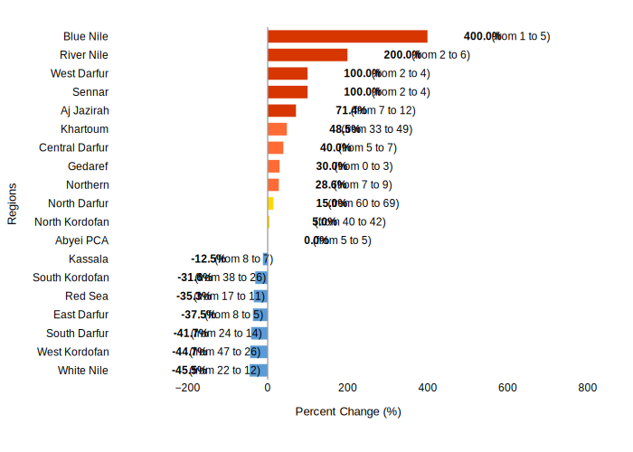

# Sudan Security Report: Recent Developments and Forward Outlook

## 1. Overview
Sudan continues to face a complex and volatile security landscape, primarily characterized by the ongoing conflict between the Sudanese Armed Forces (SAF) and the Rapid Support Forces (RSF). Recent events, predominantly occurring between April and July 2025, highlight intensified hostilities across multiple states, significant impacts on civilian populations, and evolving political dynamics among armed groups. The conflict has led to widespread displacement, casualties, and disruptions to essential services and humanitarian operations, underscoring a persistent state of instability across the country.

## 2. Key Security Events

### Intensified Hostilities and Territorial Control
The conflict has seen a continuation of intense fighting and shifts in territorial control. North Darfur, particularly around El Fasher and its surrounding displacement camps such as Zamzam and Abu Shouk, remains a major flashpoint. Continuous clashes between RSF paramilitary and government forces were reported in Zamzam Camp on April 12, 2025 [3]. Fighting in multiple parts of El Fasher persisted on April 23, 2025 [5], with new clashes between RSF and Sudanese armed forces reported in the northeast of El Fasher on April 17, 2025 [6]. RSF militia forces shelled Abu Shouk camp and the Al-Quba and Al-Nasr neighborhoods of El Fasher on April 23, 2025 [7]. On April 11, 2025, RSF launched new strikes in El Fasher, prompting army response, with at least 20 people reportedly killed during RSF paramilitary shelling in the city [10]. The rebel group Sudan Liberation Movement called on the army for help in El Fasher on April 13, 2025, due to ongoing paramilitary bombing, including in nearby displacement camps [13]. On April 13, 2025, the RSF claimed control over Zamzam camp south of El Fasher amid reports of clashes and large-scale displacement [18].

In Khartoum State, the army claimed to have recaptured the state in full from the RSF militia on May 20, 2025, though fighting was still reported in Omdurman [8]. On June 27, 2025, the state security affairs coordination committee implemented a night curfew from 11 PM and prohibited all public and private celebrations to promote security in Khartoum.

Drone attacks have been a prominent feature of recent hostilities. In River Nile State, Sudanese media reported a drone attack on Atbara on May 11, 2025 [1]. An earlier drone attack on April 25, 2025, targeted a camp for displaced people in Atbara and reportedly hit the city's power station, causing outages in both River Nile and Red Sea States [4]. In White Nile State, the RSF targeted an army command in Kosti with a drone strike on April 29, 2025 [9], and launched drone strikes on Sudanese military positions in the Arshkool area on April 27, 2025 [11]. Explosions near oil depots in Kosti were reported on May 8, 2025 [16].

The RSF also captured the town of Al-Khawi in South Kordofan province on May 3, 2025, as rival army forces retreated toward El Obeid [14]. In Northern State, renewed roadblocking by protesters in Wadi Halfa was reported on June 4, 2025, with threats of escalation including disruption of mining operations [12].

### Political and Strategic Developments
A significant political development occurred on July 1, 2025, when Sudan's rebel RSF formed a political alliance with the Sudan People’s Liberation Movement-North and other groups. This alliance aims to govern areas under RSF control, primarily in Darfur [2]. This move indicates a strategic shift by the RSF towards establishing administrative control in contested regions.

### Impact on Civilians and Humanitarian Operations
The conflict continues to have severe humanitarian consequences. On June 5, 2025, at least 14 people were killed and others injured after an RSF militia attack on a camp in El Fasher [15]. Civilian populations in conflict zones, such as El Fasher, have been subjected to shelling and attacks on displacement camps [7, 10, 13, 15].

Humanitarian operations have also been directly impacted. On June 3, 2025, a WFP and UNICEF aid convoy carrying life-saving supplies was attacked near Al Koma, North Darfur. Five members were killed, several more injured, and multiple trucks were burned [17]. This incident highlights the extreme dangers faced by humanitarian workers attempting to deliver aid in Sudan.

## 3. Forward Outlook

### Armed Conflict Probability Forecast (ConflictForecast)

According to [ConflictForecast](https://conflictforecast.org/), there is a 99.61% estimated probability that Sudan will experience an outbreak of armed conflict within the next three months.

*This forecast reflects the likelihood that the country will exceed a threshold of 0.5 fatalities per one million inhabitants over the course of three months.*

The trend in armed conflict risk, 2016-2025.

### Subnational Perspective
The security situation in Sudan is expected to remain highly dynamic, with ongoing military confrontations and evolving political alignments shaping the future. The subnational perspective reveals distinct challenges and vulnerabilities across different states.

#### Predicted Increase in Violent Events in the Next Month (ACLED)

[ACLED CAST](https://acleddata.com/conflict-alert-system/) predicts 9 ADM1 regions in Sudan to be hotspots for violent events in the next calendar month (August, 2025).

*An ADM1 region is considered to be a hotspot if the predicted increase in the number of violent events in the next month compared to the 3-month average is at least of 25%.*

The chart below shows regions with a predicted change in violent events.

Considering the hotspot criteria, the following regions are expected to have a significant increase in violent events in August, 2025:

| Region | Avg. # Violent Events (3 months) | Forecasted # Violent Events | % Increase |
|---|---|---|---|
| Khartoum | 33 | 49 | 48.5% |
| Northern | 7 | 9 | 28.6% |
| River Nile | 2 | 6 | 200.0% |
| Sennar | 2 | 4 | 100.0% |
| West Darfur | 2 | 4 | 100.0% |
| Central Darfur | 5 | 7 | 40.0% |
| Blue Nile | 1 | 5 | 400.0% |
| Aj Jazirah | 7 | 12 | 71.4% |
| Gedaref | 0 | 3 | 30.0% |
#### Khartoum
The capital region continues to be a focal point of control and contestation. The Government of Sudan's implementation of security measures, such as night curfews and prohibitions on public gatherings on June 27, 2025, indicates an ongoing need for control and suggests persistent underlying instability. Despite the army's claim of fully recapturing Khartoum State on May 20, 2025 [8], reports of continued fighting in Omdurman suggest that pockets of resistance or sporadic clashes may persist, posing a risk to civilian safety and normal life.

#### Northern
The Northern state faces potential for continued civil unrest and disruption of economic activities. Renewed roadblocking by protesters in Wadi Halfa on June 4, 2025, and threats of escalation, including the disruption of mining operations [12], indicate a volatile environment. Such actions could lead to further economic strain and localized security incidents.

#### River Nile
This state remains highly vulnerable to drone attacks, as demonstrated by incidents in Atbara on April 25 and May 11, 2025 [1, 4]. These attacks have targeted both displaced persons' camps and critical infrastructure like power stations, leading to widespread power outages in River Nile and Red Sea States [4]. The continued use of drones poses a significant threat to civilian safety and essential services, potentially exacerbating humanitarian needs.

#### Sennar
No specific security events were reported in the provided context for this region.

#### West Darfur
While specific events for West Darfur are not detailed in the provided text chunks, the broader Darfur region remains a primary conflict zone. The RSF's formation of a political alliance on July 1, 2025, to govern areas under its control, primarily in Darfur [2], suggests a complex and evolving governance landscape alongside ongoing hostilities. This indicates continued instability and humanitarian challenges across the Darfur states.

#### Central Darfur
The region has experienced violence against civilians. The broader Darfur conflict, including the RSF's political ambitions to govern areas under its control [2], indicates continued instability and humanitarian challenges.

#### Blue Nile
The Blue Nile region has experienced clashes between the SAF and RSF. SAF operations to retake control of areas like Baldago and surrounding parts of Maban county suggest ongoing military engagements and a contested security environment.

#### Aj Jazirah
An accidental ordnance explosion has been reported in Aj Jazirah, indicating residual dangers from conflict or potential for isolated incidents.

#### Gedaref
No specific security events were reported in the provided context for this region.

## 4. Sources
[1] x.com/alrakoba1: x.com/alrakoba1/status/1921381323614154780, 2025-05-11
[2] sudantribune.com: https://sudantribune.com/article302486/, 2025-07-01
[3] sudanakhbar.com: https://www.sudanakhbar.com/1638014, 2025-04-12
[4] x.com/alswdan54: x.com/alswdan54/status/1915629951425941673, 2025-04-25
[5] x.com/AlHadath: x.com/AlHadath/status/1915153899826069585, 2025-04-23
[6] sudanakhbar.com: https://www.sudanakhbar.com/1639592, 2025-04-17
[7] t.me/AjaNews: https://t.me/AjaNews/372519, 2025-04-23
[8] x.com/AJABreaking: x.com/AJABreaking/status/1924726433349566752, 2025-05-20
[9] x.com/AJABreaking: x.com/AJABreaking/status/1917326895366168633, 2025-04-29
[10] x.com/MUAMMAR_SUD: x.com/MUAMMAR_SUD/status/1910627006451941397, 2025-04-11
[11] x.com/AJABreaking: x.com/AJABreaking/status/1916541074803396977, 2025-04-27
[12] facebook.com/SUDAN4ALL: https://www.facebook.com/SUDAN4ALL/posts/pfbid09BSGu2AskVcXuMAYJry3ofjRBmCsnpy8V29GzXEUrUDFwVWTW1YxnGj5YjENaKs3l, 2025-06-04
[13] sudanakhbar.com: https://www.sudanakhbar.com/1638369, 2025-04-13
[14] x.com/AlHadath: x.com/AlHadath/status/1918659901389250908, 2025-05-03
[15] newarab.com: https://www.newarab.com/news/rsf-attack-sudan-displacement-camp-darfur-kills-14, 2025-06-05
[16] x.com/AJABreaking: x.com/AJABreaking/status/1920308180661514253, 2025-05-08
[17] unicef.org: https://www.unicef.org/press-releases/wfpunicef-humanitarian-aid-convoy-carrying-life-saving-supplies-attacked-sudans, 2025-06-03
[18] x.com/ajmurgent: x.com/ajmurgent/status/1911457780273467678, 2025-04-13

---

# Metadata

**Generated on:** 2025-07-07 12:02:13

**Country:** Sudan

**Retriever used for report generation:** HybridCypher

**Forecast data path:** forecast_data_Sudan_2025-07-07-12-01-18.json

**Configuration:**
- search_params: {'top_k': 20, 'ranker': 'linear', 'alpha': 0.5}
- graphrag_model: gemini-2.5-flash