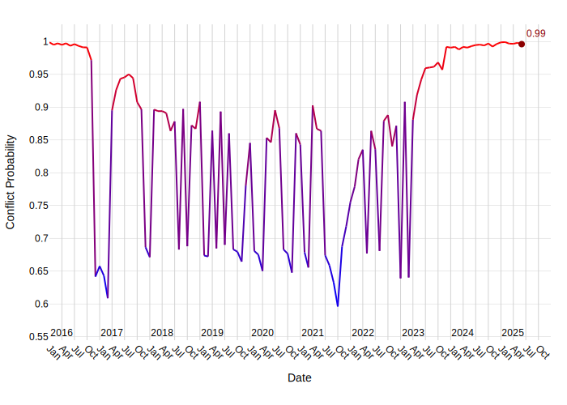
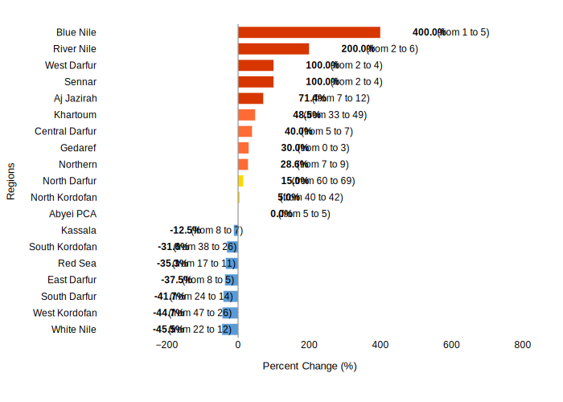

# Sudan Security Report: Escalating Conflict and Humanitarian Crisis (June-July 2025 Outlook)

## 1. Overview

Sudan has been engulfed in a devastating civil war since fighting erupted on April 15, 2023, between the Sudanese Armed Forces (SAF) and the paramilitary Rapid Support Forces (RSF) [4]. This conflict shattered a brief period of peace following recent coups and two prior civil wars, severely worsening an already precarious humanitarian situation [4]. As of July 2, 2025, the war is raging into its third year, leading to an estimated 150,000 deaths, displacing over 14 million people, and pushing more than 24 million to crisis levels of hunger [5]. The World Food Program (WFP) has characterized the situation as "the world’s worst humanitarian crisis" [5].

The conflict stems from a power struggle between SAF leader General Abdel Fattah al-Burhan and RSF General Mohamed Hamdan Dagalo (Hemedti), who were initially allies in the 2019 overthrow of dictator Omar al-Bashir and the subsequent 2021 coup that toppled Sudan’s interim government [4]. Hemedti's violent revolt in mid-April 2023 was triggered by Burhan's push to integrate the RSF into the national army [4]. The RSF, originally created by Omar al-Bashir as a border force, has historically been involved in violent operations, with its precursor, the Janjaweed, implicated in atrocities in Darfur since 2003 [5]. The RSF reportedly funds its operations largely through gold mines, with most of the gold sold to the Emirates [5].

International efforts to mediate peace, including negotiations led by the United States and Saudi Arabia, have resulted in over a dozen failed ceasefires [4]. Peace plans proposed by the African Union and other regional blocs have also been unsuccessful [4]. An Egypt-led conference in July 2023 established humanitarian corridors and a framework for political dialogue, but failed to resolve the conflict [4]. The Sudanese government suspended its membership in the Intergovernmental Authority on Development (IGAD) in January 2024 due to its outreach to Hemedti and has restricted media access within Sudan [4]. Currently, negotiations remain at a standstill due to a lack of political will from both sides [4].

## 2. Key Security Events

Recent security events highlight the ongoing intensity and widespread impact of the conflict across Sudan:

### Military Engagements and Territorial Control
*   **April 10, 2025 (North Darfur):** Clashes occurred between RSF and Shugara-Berti forces in Umm Keddada. RSF initially took control of the area, but Shugara forces later regained it. These clashes resulted in approximately 10 civilian fatalities and the displacement of 3,500 households. RSF forces were also reported to have looted civilians and Starlink networks [11].
*   **April 15, 2025 (Khartoum):** Clashes between SAF and RSF continued in Al Sufayra (Um Bada). The SAF regained control of the village and claimed to have killed dozens of RSF fighters, with 3 fatalities recorded for this event [7].
*   **April 18, 2025 (North Darfur):** The Sudanese military reported successfully thwarting an attack by RSF paramilitaries attempting to advance into northern El Fasher [13].
*   **April 23, 2025 (North Darfur):** Fighting persisted between Sudan's warring military factions in multiple areas of el-Fasher [6]. On the same day, RSF militia forces shelled the Abu Shouk camp and the Al-Quba and Al-Nasr neighborhoods of El Fasher [10].
*   **April 27, 2025 (White Nile):** The RSF launched drone strikes targeting a Sudanese military position in the Arshkool area [2].
*   **April 29, 2025 (White Nile):** The RSF conducted another drone strike, targeting the army command in the town of Kosti [8].
*   **May 11, 2025 (South Darfur):** The Sudanese army carried out airstrikes against RSF positions in the Nyala and El Geneina areas of Darfur [14].
*   **May 19, 2025 (Khartoum):** Clashes between SAF and RSF continued in Omdurman - Al Salha. The SAF regained control of a significant portion of the neighborhood and seized a large quantity of RSF weapons. Approximately 3 fatalities were recorded [15].
*   **May 20, 2025 (Khartoum):** Military sources indicated that Khartoum State had been fully recaptured from the RSF by the army, although fighting was still reported in Omdurman [9].
*   **May 23, 2025 (South Kordofan):** Clashes between SAF, supported by Darfur Joint Forces/JSAMF, and RSF continued in Dibebad. The SAF regained control of the area, which the RSF had previously overtaken on June 21, 2023. The Joint Forces claimed to have inflicted heavy losses on RSF personnel and equipment (estimated 10 fatalities), with 1 SAF soldier also killed, totaling 11 fatalities. This event also led to the displacement of 565 households [17].
*   **June 13, 2025 (Blue Nile):** Clashes between SAF and RSF continued in Bout, with RSF artillery shelling reported. No fatalities were recorded [16].
*   **June 14, 2025 (Blue Nile):** Further clashes between SAF and RSF occurred in southwestern Bout, resulting in an unspecified number of RSF fatalities, coded as 3 [12].

### Civilian Impact and Governance
*   **May 1, 2025 (River Nile):** The Governor renewed the state of emergency across River Nile state (Ad Damar) due to persistent insecurity in the region [3].
*   **June 28, 2025 (River Nile):** A mine collapse in a desert area of River Nile state is feared to have killed at least 50 people. Rescue efforts were reportedly delayed due to the remote location and poor road conditions [1].

### United Nations Humanitarian Operations
The ongoing conflict has exacerbated an already severe humanitarian crisis in Sudan. Before the civil war, nearly 16 million people faced severe food insecurity, and an estimated 3.7 million were internally displaced, with Sudan hosting 1.3 million refugees, mostly from South Sudan [4]. The current conflict has led to the displacement of over 14 million people and pushed more than 24 million to crisis levels of hunger, a situation the World Food Program (WFP) describes as the "world’s worst humanitarian crisis" [5]. Neighboring countries are now hosting over 4 million Sudanese refugees, raising concerns about broader regional destabilization [4]. Reports indicate widespread human rights abuses, including ethnic cleansing, sexual violence, and mass killings, primarily carried out by the RSF, particularly in Darfur [5].

## 3. Forward Outlook

The security outlook for Sudan remains highly volatile and challenging, with ongoing conflict between the SAF and RSF, a severe humanitarian crisis, and stalled peace negotiations. The deep trauma inflicted, particularly in regions like Darfur, makes reconciliation a formidable task, with many Sudanese finding forgiveness for RSF atrocities "almost impossible" [5].

### Armed Conflict Probability Forecast (ConflictForecast)

According to [ConflictForecast](https://conflictforecast.org/), there is a 99.61% estimated probability that Sudan will experience an outbreak of armed conflict within the next three months.

*This forecast reflects the likelihood that the country will exceed a threshold of 0.5 fatalities per one million inhabitants over the course of three months.*

The trend in armed conflict risk, 2016-2025.

### Subnational Perspective

#### Predicted Increase in Violent Events in the Next Month (ACLED)

[ACLED CAST](https://acleddata.com/conflict-alert-system/) predicts 9 ADM1 regions in Sudan to be hotspots for violent events in the next calendar month (August, 2025).

*An ADM1 region is considered to be a hotspot if the predicted increase in the number of violent events in the next month compared to the 3-month average is at least of 25%.*

The chart below shows regions with a predicted change in violent events.

Considering the hotspot criteria, the following regions are expected to have a significant increase in violent events in August, 2025:

| Region | Avg. # Violent Events (3 months) | Forecasted # Violent Events | % Increase |
|---|---|---|---|
| Blue Nile | 1 | 5 | 400.0% |
| Gedaref | 0 | 3 | 30.0% |
| Khartoum | 33 | 49 | 48.5% |
| Central Darfur | 5 | 7 | 40.0% |
| Northern | 7 | 9 | 28.6% |
| Aj Jazirah | 7 | 12 | 71.4% |
| Sennar | 2 | 4 | 100.0% |
| West Darfur | 2 | 4 | 100.0% |
| River Nile | 2 | 6 | 200.0% |
#### Blue Nile
The Blue Nile state continues to experience active clashes between the SAF and RSF, as evidenced by recent engagements in Bout on June 13 and 14, 2025 [12, 16]. This indicates persistent insecurity and a high risk of further armed confrontations in the region.

#### Gedaref
No specific recent security events or forward-looking information for Gedaref state were provided in the context.

#### Khartoum
Khartoum, the capital, has seen significant military activity, with the SAF regaining control of areas like Al Sufayra (Um Bada) on April 15, 2025 [7], and a large portion of Omdurman - Al Salha on May 19, 2025 [15]. While military sources reported the full recapture of Khartoum State from the RSF by May 20, 2025, fighting continued in Omdurman [9]. The context also notes that some areas in Khartoum have been liberated, leading to initial returns of displaced populations [5]. The outlook for Khartoum involves continued efforts to consolidate SAF control and manage the return of displaced persons, though residual pockets of resistance or sporadic clashes may persist.

#### Central Darfur
No specific recent security events or forward-looking information for Central Darfur state were provided in the context.

#### Northern
No specific recent security events or forward-looking information for Northern state were provided in the context.

#### Aj Jazirah
The context indicates that some areas in Aj Jazirah have been liberated, and people are beginning to return [5]. This suggests a cautiously optimistic outlook for stabilization and recovery in these specific areas, provided the broader conflict does not re-escalate significantly.

#### Sennar
No specific recent security events or forward-looking information for Sennar state were provided in the context.

#### West Darfur
West Darfur, particularly the broader Darfur region, remains a critical hotspot for violence and human rights abuses. SAF airstrikes targeted RSF positions in El Geneina on May 11, 2025 [14]. The region has been the epicenter of ethnic cleansing, sexual violence, and mass killings attributed to the RSF and its precursor, the Janjaweed, since 2003 [5]. The outlook for West Darfur is grim, with continued risk of ethnically-driven violence, displacement, and severe humanitarian needs.

#### River Nile
River Nile state faces ongoing insecurity, leading to the renewal of a state of emergency by the Governor on May 1, 2025 [3]. The recent mine collapse on June 28, 2025, resulting in an estimated 50 fatalities, highlights additional risks beyond direct conflict, such as industrial incidents exacerbated by poor infrastructure and remote locations [1]. The security situation in River Nile is likely to remain fragile, influenced by both direct conflict spillover and other hazards.

## 4. Sources

[1] proceso.hn: https://proceso.hn/mueren-al-menos-50-personas-al-derrumbarse-una-mina-de-oro-en-el-norte-de-sudan/, 2025-06-28
[2] x.com/AJABreaking: x.com/AJABreaking/status/1916541074803396977, 2025-04-27
[3] Context provided, 2025-05-01
[4] Council on Foreign Relations: https://www.cfr.org/in-brief/what-extent-sudans-humanitarian-crisis, 2025-06-26
[5] TRT Global: https://trt.global/world/audio/26e5819f8900, 2025-07-02
[6] x.com/AlHadath: x.com/AlHadath/status/1915153899826069585, 2025-04-23
[7] Context provided, 2025-04-15
[8] x.com/AJABreaking: x.com/AJABreaking/status/1917326895366168633, 2025-04-29
[9] x.com/AJABreaking: x.com/AJABreaking/status/1924726433349566752, 2025-05-20
[10] t.me/AjaNews: https://t.me/AjaNews/372519, 2025-04-23
[11] Context provided, 2025-04-10
[12] Context provided, 2025-06-14
[13] sudanakhbar.com: https://www.sudanakhbar.com/1639894, 2025-04-18
[14] sudanakhbar.com: https://www.sudanakhbar.com/1647482, 2025-05-11
[15] Context provided, 2025-05-19
[16] Context provided, 2025-06-13
[17] Context provided, 2025-05-23

---

# Metadata

**Generated on:** 2025-07-07 23:51:28

**Country:** Sudan

**Retriever used for report generation:** HybridCypher

**Forecast data path:** forecast_data_Sudan_2025-07-07-23-50-38.json

**Configuration:**
- search_params: {'top_k': 20, 'ranker': 'linear', 'alpha': 0.5}
- graphrag_model: gemini-2.5-flash