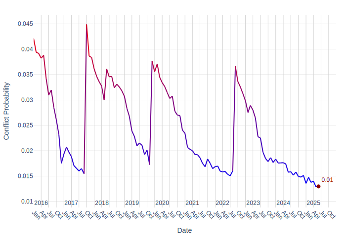
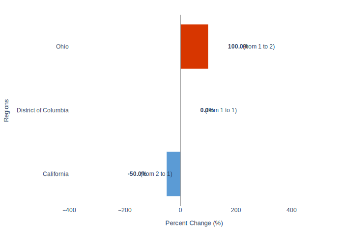

# United States Security Report: June 2025

## 1. Overview
The security situation in the United States during June 2025 is primarily marked by significant policy changes related to national entry. A notable event includes the implementation of new travel restrictions affecting multiple countries [1].

## 2. Key Security Events
### Travel Restrictions Imposed
On June 4, 2025, President Trump issued a ban on the entry of nationals from 12 countries, including Afghanistan, Haiti, and Iran. This directive also included partial restrictions on seven additional nations. This security measure, categorized under travel and immigration, was enacted in Washington, D.C. [1].

## 3. Forward Outlook
### Armed Conflict Probability Forecast (Conflict Forecast)

According to [ConflictForecast](https://conflictforecast.org/), the predicted probability of armed conflict in United States in the next 3 months is of 1.30%.

*This prediction represents the risk that a country suffers an outbreak of armed conflict within the next three months, i.e. that the country goes from no fatalities to over 0.5 fatalities per one million inhabitants within a time horizon of three months.*

The following chart displays the armed conflict risk trend since 2020 until the present day:

### Subnational Perspective
#### Predicted Increase in Violent Events in the Short Term (ACLED)

[ACLED CAST](https://acleddata.com/conflict-alert-system/) predicts 1 ADM1 regions in United States to be hotspots for violent events in the next calendar month (August, 2025).

*An ADM1 region is considered to be a hotspot if the predicted increase in the number of violent events in the next month compared to the 3-month average is at least of 25%.*

The chart below shows regions with a predicted change in violent events.

Considering the hotspot criteria, the following regions are expected to have a significant increase in violent events in August, 2025:

| Region | Avg. # Violent Events (3 months) | Forecasted # Violent Events | % Increase |
|---|---|---|---|
| Ohio | 1 | 2 | 100.0% |
#### Ohio
Ohio is projected to be a subnational conflict hotspot, with an anticipated increase in violent events. The region experienced an average of 1.0 violent event over the last three months. The short-term forecast predicts 2.0 violent events, indicating a 100.0% increase [Context provided].

## 4. Sources
[1] Context provided. (Information from record dated 04 June 2025, Washington, DC, US, regarding Trump's travel ban).

---

# Metadata

**Generated on:** 2025-07-05 11:28:30

**Country:** United States

**Retriever:** HybridCypher

**Forecast data path:** forecast_data_United_States_2025-07-05-11-28-15.json

**Configuration:**
- search_params: {'top_k': 20, 'ranker': 'linear', 'alpha': 0.5}
- graphrag_model: gemini-2.5-flash