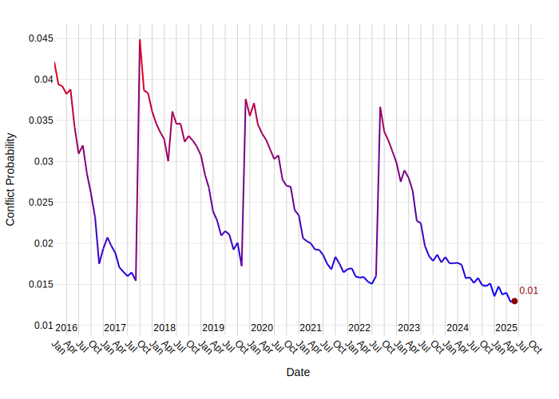
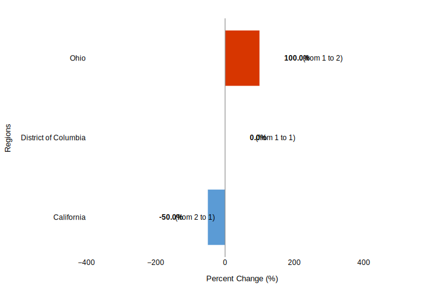

# A Comprehensive Security Report: United States

## 1. Overview
The United States is currently navigating a complex and volatile global security landscape, characterized by intensifying great-power rivalry and domestic political shifts [1]. As of July 3, 2025, relations with China are particularly precarious, marked by a norm-busting trade war and strategic mistrust [1]. Both nations are governed by strident nationalist coalitions, with an anti-globalization backlash influencing domestic politics [1]. There is no common security threat currently drawing the two countries together; instead, they often find themselves on opposing or orthogonal sides in international conflicts, such as those between Russia and Ukraine, and Israel and Iran [1]. The strategic costs to the United States of conceding influence in the Indo-Pacific to China are deemed to far outweigh any potential economic benefits, underscoring the critical importance of maintaining regional stability [1].

## 2. Key Security Events

### Geopolitical Engagements and Rivalries
The strategic rivalry between the United States and China continues to define a significant aspect of the U.S. security posture. Efforts to achieve a "grand bargain" between U.S. President Donald Trump and Chinese President Xi Jinping are considered remote due to historical patterns of cooperation only when facing a common enemy, and current internal political dynamics [1]. The current environment is likened to the Cold War era of the 1950s and 1960s, when China and the United States found themselves completely at loggerheads across both security and economic dimensions of statecraft [1].

Key areas of tension and discussion include:
*   **Trade and Economic Policies:** The Trump administration imposed tariffs on China in April 2025, reaching 145 percent, which were met with retaliatory tariffs of 125 percent by China and export restrictions on critical rare-earth minerals and magnets [1]. Although a temporary trade truce has been agreed upon, deeper economic issues such as falling living standards, rising prices, and a poor job market remain unaddressed [1].
*   **South China Sea and Maritime Security:** Preventing accidental conflict in the South China Sea is a critical goal, with proposals for more reliable communication channels, military-to-military dialogues, and confidence-building measures such as prelaunch notification procedures for space launches and real-time cyberwarfare and hacking protocols [1]. Such initiatives aim to reassure allies in Asia of the United States’ commitment to regional peace and security [1].
*   **Cybersecurity:** Establishing norms against cyber-espionage and state-sponsored commercial cybertheft is also a key objective in U.S.-China relations [1].
*   **Alliances and Regional Stability:** Any broad concessions to China on issues like Taiwan or claims in the South China Sea could unravel decades of regional security architecture and seriously compromise the security of core U.S. allies, including Japan and the Philippines [1]. This could lead to a perilous security dilemma, potentially driving allies like Japan to consider acquiring nuclear weapons [1].
*   **Russia-Ukraine Conflict:** The U.S. decision to suspend military aid to Ukraine will particularly degrade Ukraine's ability to defend against Russia's enhanced long-range missile and drone strike capabilities that have inflicted significant civilian casualties [10]. This is in sharp contrast to President Trump's stated objective of stopping civilian casualties in Ukraine [10]. Russian forces advanced in northern Kharkiv Oblast and near Toretsk and Novopavlivka as of July 2, 2025 [10].
*   **Israel-Iran Conflict:** On July 1, 2025, U.S. President Trump stated that Israel "agreed to the necessary conditions to finalize" a 60-day ceasefire in the Gaza Strip, threatening that if the Palestinian militant group Hamas does not accept the deal, "it will not get better — IT WILL ONLY GET WORSE" [12].

### Multilateral Security Initiatives
The U.S. actively participates in multilateral forums to address emerging threats and strengthen regional partnerships:
*   **Short Range Air Defense (SHORAD) Symposium:** From June 23-26, 2025, the Pacific Integrated Air and Missile Defense Center (PIC) hosted its first multilateral SHORAD Symposium at Joint Base Pearl Harbor-Hickam in Honolulu, Hawaii [2, 3]. This event focused on addressing gaps in capabilities and responsibilities related to the emerging small unmanned airborne system (UAS) threat, a significant concern for U.S. allies and partners throughout the region [2, 3]. Collaboration involved groups such as the Federal Aviation Administration (FAA), U.S. Army’s Joint Counter-small Unmanned Aircraft Systems Office, 94th Army Air and Missile Defense Command, 1st Multidomain Task Force, U.S. Air Force’s Air Combat Command, Pacific Air Forces, U.S. Marine Corps’ 3rd Littoral Anti-Air Battalion, and the U.S. Navy’s Naval Surface Group Middle Pacific [2, 3]. Attending nations included Australia, Indonesia, Japan, Netherlands, Philippines, Republic of Korea, Singapore, Sri Lanka, and Thailand [2, 3].
*   **Quad Foreign Ministers Meeting:** On July 1, 2025, the second Quad foreign ministers meeting of the year convened in Washington, D.C., demonstrating the strength and importance of the Quad partnership amidst global turmoil in the Middle East and Europe [11]. The meeting emphasized harnessing collective strength for peace, stability, and prosperity in the Indo-Pacific, covering critical issues such as technology, supply chains, and maritime security [11].

### Immigration and Border Security
*   **Travel Ban:** On June 4, 2025, President Trump issued a ban on the entry of nationals from 12 countries, including Afghanistan, Haiti, and Iran, with partial restrictions on seven more nations [8].
*   **Protests:** On June 14, 2025, Los Angeles police deployed crowd control munitions while attempting to disperse anti-ICE protesters near a federal building in California [5].

### Domestic Incidents
*   **Shootings:**
    *   On June 25, 2025, police were on the scene of a reported shooting at an apartment building in Toledo, Ohio [4].
    *   On June 16, 2025, one person was reported dead and three others injured, two of those in critical condition, following a shooting on the east side of Cleveland, Ohio [6].
*   **Fires:**
    *   On June 19, 2025, firefighters reported two people injured, one critically, in a house fire in Toledo, Ohio [7].
    *   On July 5, 2025, firefighters battled a two-acre brush fire along Highway 39 near Crystal Lake in Azusa, California [9].

### United Nations Humanitarian Operations
The provided context does not contain information directly linking to United Nations humanitarian operations.

## 3. Forward Outlook

### Armed Conflict Probability Forecast (ConflictForecast)

According to [ConflictForecast](https://conflictforecast.org/), there is a 1.30% estimated probability that United States will experience an outbreak of armed conflict within the next three months.

*This forecast reflects the likelihood that the country will exceed a threshold of 0.5 fatalities per one million inhabitants over the course of three months.*

The trend in armed conflict risk, 2016-2025.

### Subnational Perspective
#### Predicted Increase in Violent Events in the Next Month (ACLED)

[ACLED CAST](https://acleddata.com/conflict-alert-system/) predicts 1 ADM1 regions in United States to be hotspots for violent events in the next calendar month (August, 2025).

*An ADM1 region is considered to be a hotspot if the predicted increase in the number of violent events in the next month compared to the 3-month average is at least of 25%.*

The chart below shows regions with a predicted change in violent events.

Considering the hotspot criteria, the following regions are expected to have a significant increase in violent events in August, 2025:

| Region | Avg. # Violent Events (3 months) | Forecasted # Violent Events | % Increase |
|---|---|---|---|
| Ohio | 1 | 2 | 100.0% |
#### Ohio
The state of Ohio has recently experienced several security incidents, including multiple shootings and a significant house fire in June and July 2025 [4, 6, 7]. These events highlight ongoing challenges related to crime and public safety at the subnational level. Continued vigilance and local law enforcement efforts will be crucial to address these persistent issues.

## 4. Sources
[1] Foreign Affairs: https://www.foreignaffairs.com/united-states/fantasy-grand-bargain-between-america-and-china, 2025-07-03
[2] army.mil: https://www.army.mil/article/286791/pacific_integrated_air_and_missile_defense_center_launches_multilateral_shorad_symposium_2025, 2025-07-02
[3] army.mil: https://www.army.mil/article/286791/pic_launches_multilateral_shorad_symposium_2025, 2025-07-02
[4] x.com/13abc: x.com/13abc/status/1937868442599649577, 2025-06-25
[5] youtube.com: youtube.com/status/1934027942604222622, 2025-06-14
[6] wkyc.com: https://www.wkyc.com/article/news/local/cleveland/deadly-cleveland-shooting-east-55th-street-luther-avenue/95-79a955f3-d07b-4de7-a7da-7b3a0aff3500, 2025-06-16
[7] 13abc.com: https://www.13abc.com/2025/06/19/two-hospitalized-toledo-house-fire-wednesday-night/, 2025-06-19
[8] whitehouse.gov: https://www.whitehouse.gov/fact-sheets/2025/06/fact-sheet-president-donald-j-trump-restricts-the-entry-of-foreign-nationals-to-protect-the-united-states-from-foreign-terrorists-and-other-national-security-and-public-safety-threats/, 2025-06-04
[9] x.com/Angeles_NF: x.com/Angeles_NF/status/1941450479537688584, 2025-07-05
[10] Institute for the Study of War: https://understandingwar.org/backgrounder/russian-offensive-campaign-assessment-july-2-2025, 2025-07-03
[11] U.S. Department of State (.gov): https://www.state.gov/releases/office-of-the-spokesperson/2025/07/secretary-of-state-marco-rubio-indian-external-affairs-minister-subrahmanyam-jaishankar-australian-foreign-minister-penny-wong-and-japanese-foreign-minister-iwaya-takeshi-remarks-to-the-press/, 2025-07-01
[12] truthsocial.com: http://truthsocial.com/@realDonaldTrump/posts/114780321031653396, 2025-07-01

---

# Metadata

**Generated on:** 2025-07-08 09:02:11

**Country:** United States

**Retriever used for report generation:** HybridCypher

**Forecast data path:** forecast_data_United_States_2025-07-08-09-01-22.json

**Configuration:**
- search_params: {'top_k': 20, 'ranker': 'linear', 'alpha': 0.5}
- graphrag_model: gemini-2.5-flash